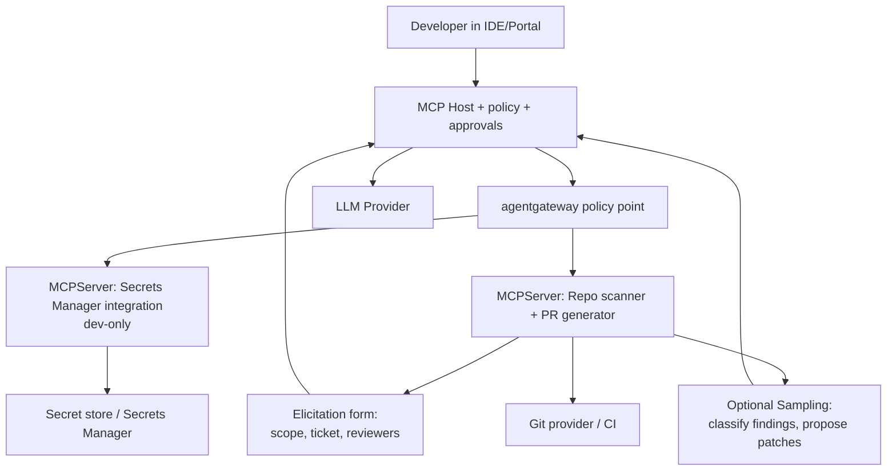
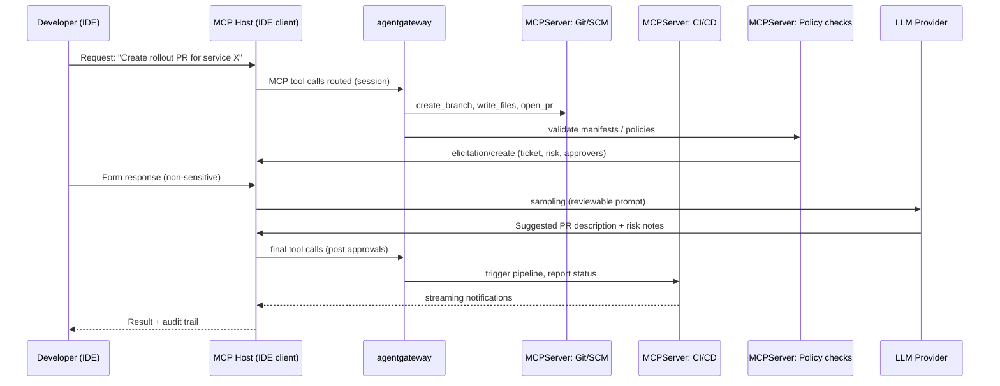
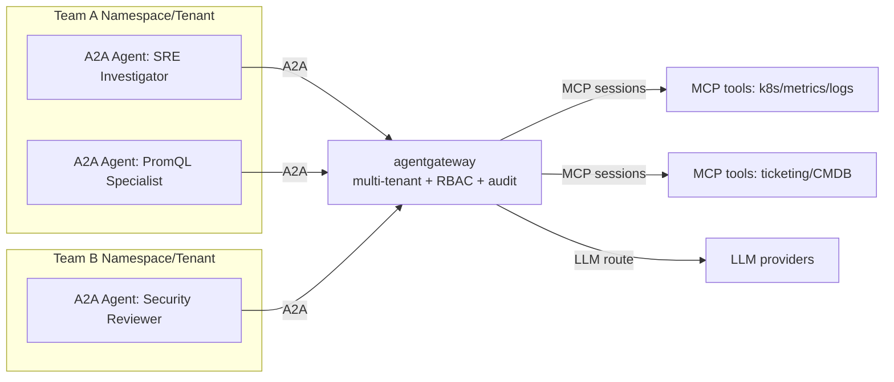
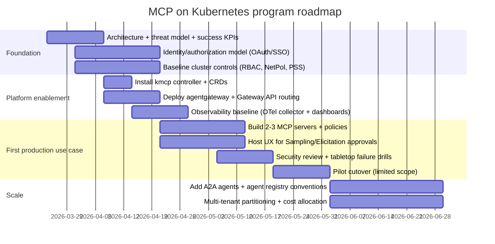

# Enterprise MCP on Kubernetes: Strategic Architecture, Production Use Cases, and Enterprise Value

## Editorial note

This merged document combines two separate research reports into one portable Markdown narrative.

- **Report A** contributed the production-oriented implementation structure: Kubernetes-native architecture, concrete case studies, controls, roadmap, and cost model.
- **Report B** contributed the strategic framing: the $N \times M$ integration problem, deeper protocol anatomy, advanced Sampling/Elicitation nuances, agent-mesh and A2A context, additional enterprise scenario patterns, and a conventional bibliography.

To keep the merged file readable and avoid citation-number collisions:

- the numbered references from **Report B** were renumbered as **[B1] ... [B67]**;
- the platform-native inline citation handles embedded in **Report A** were removed in this portable export because they are not standard Markdown links outside the original chat environment.

The structure below is not a mechanical concatenation. It has been reordered so the research flow is historically and logically consistent: **problem framing -> protocol anatomy -> advanced workflows -> Kubernetes-native platform -> production cases -> security and business value -> FinOps and cost -> roadmap -> outlook -> bibliography**.

## Executive summary

The enterprise problem around AI agents is no longer primarily model quality. It is the difficulty of connecting models to tools, data, identity, workflows, and controls at scale. In fragmented environments, every new model/tool combination tends to create bespoke integration work, producing the classic **$N \times M$ integration problem**. MCP matters because it turns those custom links into a standard host-client-server contract for context exchange and tool execution. [B1] [B3]

At production scale, the real differentiator is not "more tools" but **governance**: consent, auditability, least privilege, long-lived session handling, approval gates, secure routing, and cost control. Kubernetes is a strong operating plane for this because it already gives teams declarative deployment, identity boundaries, scaling, policy attachment, and observability. In that model, MCP servers become first-class workloads, gateways become protocol-aware policy points, and agents become manageable cluster-native services rather than isolated experiments. [B10] [B12] [B13] [B16] [B22]

This report focuses on implementable enterprise cases using MCP Sampling and MCP Elicitation, plus Kubernetes-native components such as **kmcp**, **kagent**, **agentgateway**, and **A2A**. Sampling allows an MCP server to request model completions through the client without embedding provider credentials inside each server. Elicitation allows a server to request structured human input mid-workflow, including secure out-of-band flows for sensitive actions. [B4] [B6] [B9] [B10]

The implementation assumptions carried forward from Report A remain relevant for the concrete deployment and cost sections below: (a) the enterprise runs Kubernetes in one primary region plus at least one non-prod environment; (b) costs shown are USD list prices as of March 2026; (c) 730 hours/month; (d) the largest variable cost is LLM usage (tokens), second is platform engineer time (CAPEX), and third is Kubernetes/observability OPEX; and (e) all estimated ranges are scenario-based approximations, not quotes.

## 1. Strategic problem framing

The rapid integration of generative AI into core enterprise workflows has shifted architecture concerns away from simple chatbot UX and toward **context orchestration**. Tools, data sources, identities, approvals, and event streams must be coordinated across many systems. Without standardization, every additional agent, provider, IDE, ticketing system, cloud account, and internal API increases integration entropy. That is why MCP is useful strategically: it separates model reasoning from the tool/data connectivity layer and provides a repeatable contract for hosts, clients, and servers. [B1] [B3] [B6] [B7]

A practical consequence is that enterprises can stop rebuilding one-off bridges for every assistant and instead establish a reusable AI connectivity plane. That connectivity plane still needs strong controls, because MCP does not remove risk by itself. It standardizes access patterns; security, policy, and operations still have to be designed deliberately. [B5] [B10] [B23]

## 2. Technical anatomy of MCP

### 2.1 Core protocol model

MCP’s architecture separates responsibilities: the **host** manages user experience, security policy, consent, and model integration; each **client** maintains a 1:1 stateful session to a specific server; each **server** exposes tools/resources/prompts and can request sampling through the client.  This division is foundational for enterprise governance because approval and policy enforcement belong in the host/client boundary—not inside every tool server.

### 2.2 Protocol and feature primitives that matter in production

MCP relies on JSON-RPC messages and defines standard transports: **stdio** (typically local) and **Streamable HTTP** (remote).  Earlier HTTP+SSE guidance emphasized origin validation and binding to localhost to reduce local-server risks such as DNS rebinding; those concerns remain relevant whenever a tool server is reachable from browsers or untrusted networks.

Sampling is the protocol-supported way to “nest” LLM calls inside server-side workflows without embedding model credentials into the server. It is explicitly designed so clients/hosts control model access and permissions and can require human review of prompts and results.  Elicitation is the protocol-supported way to request structured user input mid-flight (JSON schema validation), with explicit trust/safety constraints and UI expectations around clarity and decline/cancel.

Enterprise security guidance is baked into the MCP spec as non-negotiable principles: user consent/control, data privacy expectations, tool safety cautions (tools are arbitrary code execution), and explicit sampling approval controls that limit server visibility into prompts.

MCP's architectural foundation is a **stateful** client-server model rather than a stateless request-response API style. The protocol uses JSON-RPC 2.0 and centers on three important primitives: **resources**, **prompts**, and **tools**. Resources expose information the model can consume; prompts provide reusable workflow templates; tools are the execution layer through which the model affects external systems. [B4] [B6]

### 2.3 Capability negotiation and protocol lifecycle

The lifecycle of an MCP connection begins with transport establishment and capability negotiation. In practice, this matters because enterprise systems cannot assume every client, server, or host supports the same set of behaviors. Capability manifests allow the system to negotiate features such as logging, sampling, or progress tracking before real work begins. [B3] [B4] [B6]

| Message Type | Functional Role | Identifier Requirement |
|---|---|---|
| Request | Initiates a specific operation or tool call. | Required unique string or integer ID. |
| Response | Returns the result of a request or an error object. | Must match the original request ID. |
| Notification | One-way message for state updates or events. | No ID required; no response expected. |

Persistent sessions are especially important for enterprise-grade agents because they enable multi-step reasoning over intermediate tool outputs, preserve audit context, and support server-initiated events without forcing every operation into a disconnected stateless exchange. [B2] [B4] [B6]

## 3. Advanced agentic workflows: Sampling and Elicitation

Sampling and Elicitation are the two MCP capabilities that most clearly move the protocol from "tool calling" into **controlled agency**. Together they enable iterative workflows where the server can reason, ask for clarification, wait for structured human input, and continue execution without abandoning governance boundaries. [B4] [B6] [B9]

### 3.1 Sampling: recursive reasoning without server-side model lock-in

Sampling lets an MCP server request an inference from the model **through the client**. This is valuable whenever a server needs a nested reasoning step: classification, planning, log interpretation, patch suggestion, or deciding whether more information is needed. The key enterprise benefit is that the server remains model-independent and does not have to embed its own LLM SDKs or long-lived provider credentials. The host or client remains the control point for approvals, provider selection, and cost governance. [B4] [B6]

A useful mental model is recursive reasoning under supervision. For example, a security monitoring server can detect an anomaly, then ask the model to analyze relevant logs before the workflow decides whether to isolate a node, page a human, or request approval for a remediation action. [B5] [B8]

### 3.2 Elicitation: human-in-the-loop context ingestion

Elicitation is the protocol mechanism for requesting missing user input during execution. It is especially valuable when a workflow is blocked by missing parameters, policy approvals, or environment choices and the server should not guess. [B4] [B9]

#### 3.2.1 Form mode elicitation

Form mode supports structured in-band data capture in the host UI. A server can provide a JSON Schema and receive validated answers such as project identifiers, deployment regions, rollout strategies, or reviewer selections. Form mode is appropriate for **non-sensitive** inputs. [B9]

#### 3.2.2 URL mode elicitation

URL mode extends elicitation to **secure, out-of-band** interactions such as OAuth authorization, payment steps, or MFA challenges. This is particularly important in enterprise environments because sensitive credentials should not traverse the agent reasoning layer. Instead, the server can direct the user to a secure browser-based flow and continue once the authorization result is available through its own secure channel. [B9] [B10]

In practice, URL mode solves the authentication-friction problem for remote MCP servers. An IDE assistant can begin a task, realize it needs enterprise SSO to access a private GitHub or Jira resource, trigger URL-mode elicitation, and then resume the workflow once the user completes authentication. [B9] [B10]

## 4. Cloud-native AI: Kubernetes as the orchestration plane

Kubernetes has become the natural operational substrate for production-grade agents because it already solves many of the problems agent systems inherit: workload lifecycle, reconciliation, identity boundaries, secrets, service discovery, scaling, rollout control, and observability. That does not make Kubernetes "AI-aware" by itself, but it makes it an excellent place to host AI-native control planes. [B12] [B13]

### 4.1 Kubernetes-native building blocks: kmcp, kagent, agentgateway, A2A

**kmcp** provides a Kubernetes controller model for deploying MCP servers as CRDs. A common starting deployment path is: install kmcp CRDs and controller, then deploy MCP servers via an MCPServer resource managed by the controller.  kmcp’s API surface includes deployment-level controls for resource requests/limits and pod/container security context (runAsNonRoot, readOnly rootfs, allowPrivilegeEscalation, capabilities, seccomp), which is important for treating MCP servers as production workloads.  kmcp also explicitly supports TLS configuration for HTTP transports using a Kubernetes Secret containing cert/key/CA for mTLS, while warning that disabling verification is development-only.  For secrets injection, kmcp supports storing environment variables in Kubernetes Secrets and mounting them into a deployment.

**agentgateway** is positioned as an AI-native data plane for agent-to-tool (MCP) and agent-to-agent (A2A) connectivity, built for stateful sessions, fan-out, policy, security, governance, and observability.  It advertises features directly relevant to enterprises: RBAC, multi-tenancy, dynamic updates via xDS, and a Kubernetes controller leveraging the Kubernetes Gateway API.  Its Kubernetes docs motivate why traditional stateless gateways don’t fit MCP/A2A: long-lived stateful JSON-RPC sessions, session fan-out across multiple tool servers, server-initiated events, and per-session authorization/tool poisoning protection.

In a Kubernetes Gateway API architecture, a Gateway exposes listeners, HTTPRoute defines routing, and implementations apply that configuration to underlying load balancers or in-cluster proxies.  agentgateway documentation and examples follow this pattern, emphasizing Gateway, backends, and HTTPRoutes as Kubernetes-native, version-controllable routing resources.

**kagent** is an open-source Kubernetes-native framework for building and operating agents, with a controller, UI, engine, and CLI as core components.  kagent emphasizes extensibility and observability, including OpenTelemetry support.  It also supports “agents as tools,” enabling composition patterns where one specialized agent is invoked by another.

**A2A (Agent2Agent)** is an open protocol aimed at enabling agents built by different parties on different infra to discover capabilities, negotiate modalities, and collaborate on long-running tasks without exposing internal state/tools.  In the kagent ecosystem, agents can be exposed through A2A and invoked by an A2A client.

Additional strategic context from the second report strengthens the same conclusion:

- **KMCP** is not just a deployment shortcut. It turns MCP servers into native Kubernetes resources and lets platform teams manage them with the same operational language they already use for other services. [B16] [B17]
- **kagent** adds an agent runtime and control framework that is explicitly aimed at Kubernetes operations, troubleshooting, GitOps tasks, and service-health workflows. [B14] [B20] [B21]
- The emerging **Agent Mesh** idea is important architecturally because it moves concerns such as prompt controls, rate limits, and context-aware governance closer to the runtime interaction layer rather than leaving them scattered across individual tools. [B22]
- **agentgateway** fits here as the protocol-aware security and policy point that can enforce identity mapping, routing, and observability across both agent-to-tool and agent-to-agent paths. [B10] [B23] [B45] [B46]

### 4.2 Inter-agent communication with A2A

A2A matters once a single coordinator agent becomes too context-heavy, too expensive, or too brittle. Instead of asking one agent to know everything, organizations can let specialized agents collaborate across a common protocol. [B24] [B26] [B31] [B34]

#### 4.2.1 Discovery through Agent Cards

A2A agents publish machine-readable "Agent Cards" that describe identity, skills, endpoints, and authentication requirements. That lets a coordinator discover a specialist and delegate work dynamically instead of hardcoding every downstream integration. [B27] [B29] [B34]

#### 4.2.2 Task lifecycle and state model

A2A is organized around a task lifecycle rather than a single stateless call:

| Task State | Description | Implementation Detail |
|---|---|---|
| Submitted | The task has been received by the server. | Initial state upon submission. |
| Working | The agent is actively processing the task. | Can stream updates or intermediate events. |
| Input-Required | The server needs more information to proceed. | Can trigger a clarification or human-in-the-loop response. |
| Completed | The task finished successfully. | Returns artifacts, reports, or structured output. |
| Failed / Canceled | Execution was interrupted. | Should preserve enough information for debugging and audit. |

This model is particularly useful for long-running workflows such as infrastructure audits, migration planning, or multi-stage incident investigations. [B30] [B35] [B36] [B37]

## 5. Production case studies

The case studies below are designed to be implementable with MCP Sampling and/or MCP Elicitation in production-like environments, while aligning to Kubernetes-native deployment (kmcp), gateway enforcement (agentgateway), and agent frameworks (kagent/A2A). Where a detail is implementation-specific (e.g., exact org IAM), the report states an assumption.

### 5.1 SRE incident response copilot with controlled remediation

**Problem statement (enterprise reality):** SRE teams spend time on triage, correlation, and repetitive diagnostics (logs/metrics/events). The risk is not “lack of intelligence” but unsafe automation and over-permissioned tooling.

**Technical design overview:**
A ChatOps/portal “MCP Host” connects to multiple MCP servers deployed in Kubernetes (via kmcp CRDs) for: Kubernetes read actions, Prometheus queries, Grafana lookups, and ticketing automation. A “remediation” tool server can request Sampling for analysis and Elicitation for structured approvals (e.g., reason for restart, rollback plan). Sampling’s “human in the loop” expectations are used for any step that changes production state.

**Architecture (logical):**
```mermaid
flowchart LR
  U[SRE in ChatOps/Portal] --> H[MCP Host<br/>policy + consent + audit]
  H --> C1[MCP Client: Observability]
  H --> C2[MCP Client: Kubernetes Ops]
  H --> C3[MCP Client: Ticketing/Oncall]

  C1 --> AG[agentgateway<br/>policy + routing + audit]
  C2 --> AG
  C3 --> AG

  AG --> M1[MCPServer: Prometheus/Grafana tools<br/>kmcp-managed]
  AG --> M2[MCPServer: Kubernetes read-only tools<br/>kmcp-managed]
  AG --> M3[MCPServer: Remediation workflow<br/>kmcp-managed]

  M3 --> EL[Elicitation request<br/>structured approval form]
  M3 --> SA[Sampling request<br/>nested LLM call via Host]
  EL --> H
  SA --> H
  H --> LLM[LLM Provider(s)]
```

**Key integration points and data flows:**
- MCP host/client boundary enforces user consent and prompt/result review for Sampling.
- agentgateway sits in front of MCP servers to handle session fan-out, server-initiated events, and per-session authorization/tool governance.
- kmcp deploys MCPServer resources as Kubernetes-native objects, with RBAC and cluster installation steps aligned to controller-driven lifecycle management.

**Deployment steps (Kubernetes-focused, implementable):**
1. Install kmcp CRDs and controller (once per cluster).
2. Package each MCP server as an image and deploy via `kmcp deploy`, letting the controller create/manage MCPServer resources.
3. Configure secrets via Kubernetes Secrets and mount them (kmcp supports secret references; it also provides a workflow to store env vars in Secrets).
4. Configure TLS/mTLS to MCP servers via kmcp HTTP transport TLS secretRef, using proper certificates (no insecureSkipVerify in production).
5. Put agentgateway in front of MCP servers; if kagent discovery is used, disable auto-discovery so traffic is forced through agentgateway.
6. In the host (ChatOps/portal), implement Sampling and Elicitation capability negotiation and UI flows (prompt visibility, user approve/deny; structured forms; clear server attribution).

**Security controls (what to implement and why it is business value):**
- **Least-privilege Kubernetes RBAC**: keep write permissions out of the default path; bind roles to specific subjects and scopes; avoid cluster-wide bindings where not needed.
- **Network segmentation via NetworkPolicies**: default-deny for namespaces hosting MCP servers and gateways, allowing only required ingress/egress. NetworkPolicy is Kubernetes’ L3/L4 policy mechanism (subject to the CNI supporting enforcement).
- **Pod Security Standards** enforcement to reduce privilege escalation vectors for MCP workloads, especially as these servers can mediate powerful operations.
- **Sampling approvals as a control plane**: enforce review/approval of prompts and outputs for any sampling request, aligning to spec guidance.
- **Elicitation constraints**: enforce “no sensitive information” prompts and provide explicit decline/cancel paths in UI; log every elicitation request for audit.

**Common failure modes (design for them):**
- “LLM stalls” or runaway reasoning loops: mitigate with host-level budgets, timeouts, and requiring approvals before high-cost Sampling steps. (Assumption; align budget gates with Sampling controls.)
- Streaming/session breakage: MCP uses long-lived stateful connections; generic stateless gateways often mishandle fan-out and SSE-like event routing—use an MCP-aware gateway and test reconnect semantics.
- Over-permissioning: if the agent can mutate prod without human approval, you get “fast incidents.” Enforce RBAC boundaries and explicit approvals.

**Business case (stakeholders, KPIs, ROI):**
- Stakeholders: SRE leadership, platform engineering, security (for audit/control), app owners, IT management.
- Primary KPIs:
  - MTTR and failed deployment recovery time (aligned with DORA-style recovery metrics).
  - Change failure rate if remediation introduces changes; deployment frequency/lead time if remediation is integrated with GitOps workflows.
  - “Human approvals per incident” and “automations blocked by policy” as risk-reduction signals (assumption).
- Value proposition: reduce toil and accelerate diagnostics, while using consent-driven Sampling/Elicitation to keep humans in control.

**Cost estimate (illustrative, scenario-based):**
- OPEX platform minimums (managed Kubernetes examples):
  - If using EKS, the control plane baseline is $0.10/hour in standard version support ($0.60/hour in extended).
  - If using Google Kubernetes Engine, the cluster management fee is $0.10/hour per cluster, and there is also an extended support fee model in the extended channel.
  - If using AKS: Free tier cluster management is explicitly positioned for dev/test, and Standard/Premium are for production with uptime SLAs.
- LLM OPEX example (choose one provider; prices change, so compute via token telemetry):
  - Using GPT‑5.4 list pricing: $2.50/M input tokens and $15.00/M output tokens.
  - Using Claude Opus 4.6 example pricing referenced in Claude docs: $5/MTok input and $25/MTok output.
  - Using Gemini Developer API publishes per‑1M token pricing tables (varies by model and context).
- Sizing assumptions (explicit): for a “pilot” in one cluster: 1 agentgateway deployment, 3–6 MCP servers, 2–6 replicas each depending on concurrency; 4–12 vCPU and 16–48 GiB RAM total for non-prod; 16–64 vCPU for prod with HA. These are workload-dependent and must be validated with load tests.

---

### 5.2 Secure secrets remediation and hard-coded secret migration

**Problem statement:** Hard-coded secrets and ad-hoc credential handling are persistent enterprise risks. Tooling to discover and remediate secrets exists, but teams struggle to make it safe, auditable, and compatible with developer workflows.

**Anchor real-world example:** CyberArk documents a “Secrets Manager MCP server” that can read/update secrets and supports a tested use case to scan source code, create secrets, and update source code to replace hard-coded secrets; it explicitly warns it is designed for development-only and not supported for production.

**Enterprise-ready adaptation (implementable pattern):**
- Run the secrets MCP server in a **dev-only** environment (per CyberArk guidance) and integrate it with CI pipelines and PR-based changes rather than direct in-place modifications to main branches.
- Use MCP Elicitation to collect non-sensitive metadata needed to safely proceed (ticket ID, repo scope, target secret store path, rotation policy, reviewers) and to force explicit approval before any code changes are applied. This aligns with elicitation’s structured-input model and its constraint of not requesting sensitive info.

**Architecture (logical):**


**Integration points:**
- IDE clients: VS Code is explicitly cited as supporting full MCP spec features including authorization and sampling, which enables an enterprise-grade “secure connect to remote MCP servers” story.
- Secrets MCP server requires OAuth2 client/service account patterns and recommends least-privileged dedicated users for auditability and accountability.
- MCP Authorization guidance recommends OAuth-based authorization for servers that access user-specific data or administrative operations and highlights auditability and usage tracking as reasons.

**Deployment steps:**
1. Deploy secrets MCP server into dev namespace; never expose its management endpoints publicly; keep it behind agentgateway and strict NetworkPolicies.
2. Configure OAuth2 / authorization for remote access where applicable (OAuth 2.1 conventions).
3. Implement a PR-based patch workflow: findings → proposed diffs → human review → merge. (Assumption; aligns with “explicit human review” noted as needed for AI output.)
4. Enforce “no sensitive info via elicitation” and ensure any token/credential entry happens through standard secret store workflows, not via MCP forms.

**Failure modes:**
- Secret exfiltration by over-permissioned service identities: CyberArk explicitly warns the AI agent can act with the authenticated user’s authority and that users bear responsibility for securing and preventing unauthorized access.
- Prompt injection/supply chain risks specific to LLM-integrated apps: OWASP’s LLM Top 10 highlights prompt injection, insecure output handling, supply chain vulnerabilities, and model DoS as key categories to control in enterprise deployments.
- Accidental production impact: CyberArk’s MCP server guidance explicitly says dev-only; production rollout should be a different architecture (read-only scanning in prod, PR workflow, or dedicated approved security tooling).

**Business case:**
- Stakeholders: AppSec, platform engineering, developers, auditors/compliance.
- KPIs:
  - “Hard-coded secrets reduced per sprint,” “time-to-revoke/rotate,” “secrets exposure incidents,” and audit completeness (assumptions).
  - DORA change lead time can improve if remediation is standardized and automated via PRs.
- ROI logic:
  - Reduced likelihood and blast radius of credential leakage; reduced remediation time during incidents; improved audit defensibility via dedicated identities and traceability.
  - Security as business value: lower expected incident cost (downtime, breach response, fines), and faster certification/audit cycles (assumption aligned to audit trail controls).

**Cost estimate (scenario-based):**
- Tooling: secrets store licensing is vendor-dependent (assumption). For token compute, the workflow is often batch-like and can use cheaper models; for example, OpenAI lists a “nano” tier at $0.20/M input and $1.25/M output tokens, appropriate for simple classification/extraction.
- Platform: dev-only environment still needs cluster + gateway + logging; the incremental OPEX is typically small compared to security engineering CAPEX (assumption).

---

### 5.3 Developer secure-change agent inside the IDE

**Problem statement:** Enterprises want agents inside developer tools that can perform real work (create PRs, update issues, query systems) but must maintain identity, authorization, and auditability.

**Real ecosystem anchor:** Microsoft’s VS Code blog notes VS Code supports the full MCP specification, including authorization and sampling, and frames the authorization spec as a major security milestone for delegating auth to existing identity providers rather than rolling custom OAuth.  MCP’s own security tutorial positions OAuth 2.1 flows as the mechanism for protecting sensitive resources/operations in remote MCP servers, and calls out auditing and usage tracking as key motivations.

**Technical design:**
- IDE host (VS Code or an internal MCP-capable IDE) as MCP host.
- Remote MCP servers for: source control, issue tracking, CI, artifact registry, deployment status.
- MCP Sampling used for “subagent reasoning” inside a server workflow without embedding LLM keys in each MCP server, while the user approves sampling.
- Elicitation used for “change request forms” (ticket ID, environment, rollout policy) and for collecting human approvals at the protocol level.

**Architecture (logical):**


**Kubernetes-native deployment (when tool servers are in-cluster):**
- Use kmcp to create MCPServer CRDs and manage lifecycle; disable kagent discovery when you require agentgateway to be the single routing/policy point.
- Use agentgateway + Gateway API resources for consistent routing and policy distribution in code (GitOps).

**Security controls:**
- OAuth-based authorization for remote MCP servers, enabling enterprise SSO and explicit user/tenant context in server access.
- Sampling approval gates to prevent silent model spending and to ensure the developer controls the final prompts and visibility.
- Tool safety posture: treat tool definitions and annotations as untrusted unless from a trusted server; require explicit consent before tool invocation.

**Business case:**
- Stakeholders: engineering productivity leadership, platform team, security, finance/FinOps.
- KPIs:
  - DORA lead time for changes and deployment frequency, plus change failure rate and recovery time.
  - PR throughput and review latency (assumption).
- ROI:
  - Reduced engineering time for repetitive tasks; improved standardization and compliance (“every change has ticket + policy pass + audit record”).

**Cost estimate (scenario-based):**
- LLM: use token telemetry; OpenAI’s published GPT‑5.4 tiers enable “quality vs cost” routing ($2.50/$15 for flagship; $0.75/$4.50 for mini; $0.20/$1.25 for nano).
- For multi-provider strategies, agentgateway examples show routing to multiple LLM providers behind a single Gateway API entry point (useful for failover/cost experiments).
- Platform: OPEX depends on whether MCP servers are self-hosted or vendor-hosted; if self-hosted, budget for gateway + controller + observability in each environment (assumption).

---

### 5.4 Enterprise AI connectivity plane with federated A2A agents

**Problem statement:** As teams deploy more agents, the challenge becomes controlling *agent-to-agent* and *agent-to-tool* communications: discoverability, policy, tenancy boundaries, and consistent auditing.

**Technical approach:**
- Use A2A for agent federation and collaboration across org boundaries; A2A is explicitly designed for capability discovery and secure collaboration while keeping internal agent state opaque.
- Use agentgateway as a policy/control point for both A2A and MCP connectivity (session-aware networking, governance, observability).
- Use CEL-based RBAC policies at the gateway layer to enforce access controls based on request parameters (headers, source address), default-deny behavior, and explicit allow rules.

**Architecture (logical):**


**Kubernetes-native specifics:**
- agentgateway integrates with Kubernetes Gateway API; Gateway/Routes become the GitOps-controlled source of truth for routing and policy.
- The Gateway API security model itself expects RBAC to control who can write config resources.

**Failure modes:**
- Cross-tenant data leakage if tenancy is not enforced at gateway + Kubernetes layers (RBAC, namespace isolation, NetworkPolicy).
- Tool poisoning/registry drift: agentgateway’s rationale includes explicit concern for tool poisoning protection and per-session authorization.
- Multi-agent runaway behavior (“excessive agency”): OWASP LLM Top 10 includes “excessive agency” as a class of risk; mitigate through explicit approvals, scoped tools, and budgets.

**Business case:**
- Stakeholders: platform engineering, security governance, business unit IT, compliance.
- KPIs:
  - “Agents onboarded with policy” vs “shadow agents,” policy violations, and audit completeness (assumptions).
  - Incident response improvements if federated agents shorten investigations (assumption; consistent with kagent’s focus on automating troubleshooting tasks).
- ROI:
  - Central governance reduces duplicated tool integrations and inconsistent security controls; enables internal “agent marketplace” patterns (assumption), while A2A interoperability reduces lock-in for agent frameworks.

### 5.5 Additional scenario patterns from the second report

The second report complements the detailed case studies above with three lighter-weight scenario patterns that help explain how MCP surfaces in day-to-day enterprise operations.

#### 5.5.1 DevOps: automated resource management

A kagent-style operational assistant can investigate a slow database service by reading Prometheus metrics, checking Kubernetes state, deciding that a configuration change is needed, and then triggering the corresponding infrastructure workflow before reporting back through a collaboration channel such as Slack. This pattern is useful because it shows the combination of **observability + cluster state + execution + human feedback** in one loop. [B11] [B14] [B56] [B58]

#### 5.5.2 SecOps: proactive threat containment

A security-oriented agent can connect detection systems to remediation systems: notice an anomalous login, revoke sessions or rotate access, update policies, and escalate only when necessary. This is one of the strongest examples of why structured approvals, least privilege, and auditable execution are essential. [B8] [B11]

#### 5.5.3 FinOps: automated cost governance

FinOps teams can use MCP servers for cloud and Kubernetes cost telemetry, then allow a natural-language workflow to identify idle resources, recommend weekend scale-downs, or surface underutilized GPU assets. This turns cost governance from a periodic spreadsheet exercise into a near-real-time operational workflow. [B8] [B41] [B53]

## 6. Comparative matrix and tool inventory

### 6.1 Comparative table of common enterprise MCP cases

All “estimated monthly OPEX ranges” below are scenario-based approximations (the actual range depends heavily on LLM token usage, environment count, and observability licensing). Pricing anchors for managed Kubernetes control planes and token pricing are cited where available.

| Common enterprise use case | Sampling/Elicitation role | Required components (minimum) | Complexity | Typical MVP timeline (assumption) | Estimated monthly OPEX (assumption) |
|---|---|---|---|---|---|
| SRE triage + controlled remediation | Elicitation for approvals; Sampling for analysis summaries | MCP host (ChatOps/portal), kmcp-managed MCP servers, agentgateway, observability stack, RBAC/NetworkPolicy | High | 6–10 weeks | $2k–$25k |
| Secrets migration / hard-coded secret remediation | Elicitation for scope/ticket approvals; Sampling for patch suggestion/classification | Secrets MCP server (dev-only if vendor restricts), repo/PR MCP server, OAuth auth, agentgateway policies | Medium–High | 4–8 weeks | $1k–$15k |
| IDE secure change agent (PRs + CI) | Sampling for reasoning; Elicitation for structured change requests | IDE MCP host, OAuth-secured remote MCP servers, optional in-cluster kmcp + agentgateway | Medium | 4–6 weeks | $1k–$20k |
| Enterprise AI connectivity plane (A2A + MCP governance) | Mostly policy/control; Sampling depends on host | agentgateway + Gateway API, tenancy/RBAC model, A2A agents/clients, tool registry patterns | High | 8–16 weeks | $5k–$60k |

### 6.2 Detailed inventory table of tools and roles

This inventory lists common components you can standardize as “platform products.” Where a component’s role/feature is explicitly documented, it is cited; otherwise it is an implementation suggestion (assumption).

| Tool/Agent | Type | Where it runs | Primary role | Enterprise notes / controls |
|---|---|---|---|---|
| MCP Host (IDE/Portal/ChatOps) | App | Workstations / intranet | Enforces consent, approvals, identity context, UX | Host is responsible for security boundaries and authorization decisions.  |
| MCP Client | Library/component | Inside host | Maintains 1:1 stateful session per server | Capability negotiation gates Sampling/Elicitation.  |
| MCPServer (tool server) | Service | Kubernetes | Exposes tools/resources/prompts | Treat as arbitrary code execution; require explicit consent and access control.  |
| kmcp CLI | Tooling | Dev machines / CI | Scaffold/build/deploy MCP servers | Controller-managed deployment is Kubernetes-native.  |
| kmcp controller | Kubernetes controller | Cluster | Manages MCPServer CRD lifecycle | Includes RBAC objects; deploy once per cluster.  |
| Kubernetes Secrets + kmcp secret workflow | Platform | Cluster | Secret injection into MCP servers | kmcp can mount secrets into deployments; avoid leaking via logs.  |
| agentgateway | Data plane / gateway | Cluster / edge | Connect, secure, observe MCP + A2A | RBAC, multi-tenancy, xDS updates, Kubernetes controller, protocol-aware routing.  |
| Gateway API (Gateway/HTTPRoute) | Kubernetes API | Cluster | Declarative routing & policy attachment | HTTPRoute defines routing behavior; enforce write access via RBAC.  |
| CEL-based RBAC policies | Gateway policy layer | Cluster | Condition-based allow/deny for AI endpoints | Default-deny semantics via match rules; treat as “policy-as-code.”  |
| kagent controller | Kubernetes controller | Cluster | Manages agent CRDs | Core component of kagent’s architecture.  |
| kagent engine | Runtime | Cluster | Runs agent conversation loops | Supports multiple runtimes; startup/perf tradeoffs exist (documented).  |
| kagent UI/dashboard | UI | Cluster | Manage agents/tools | Operational control plane; role-based access in enterprise offerings.  |
| A2A agents | Agent servers | Cluster / VM | Agent-to-agent collaboration | Capability discovery and modality negotiation.  |
| MCP Inspector | Dev tool | Developer machines | Test/debug MCP servers | Includes a proxy that can spawn local processes; do not expose to untrusted networks.  |
| Identity Provider + OAuth (generic) | Platform service | Enterprise IAM | AuthN/Z for remote MCP servers | MCP security tutorial recommends OAuth 2.1 conventions; audit/usage tracking motivations.  |
| Observability (OpenTelemetry) | Framework | Cluster | Traces/metrics/logs export | OTel is vendor-neutral; Kubernetes operator manages collectors and auto-instrumentation.  |

### 6.3 High-level category inventory from the second report

The second report also grouped the ecosystem by operational category. That categorization is useful because it helps map tool portfolios to business domains.

| Category | Primary Servers / Tools | Core Enterprise Functions |
|---|---|---|
| Infrastructure | KMCP, AWS/EKS, Terraform, Ansible | Resource provisioning and cluster lifecycle management. |
| Data & DB | PostgreSQL, MongoDB, Snowflake, Redis | Structured data retrieval and schema introspection. |
| Communication | Slack, Webex, Google Workspace | Human-in-the-loop updates and collaboration. |
| Version Control | GitHub, GitLab, Bitbucket | PR reviews, GitOps automation, and code analysis. |
| DevOps / Ops | Sentry, OpenCost, Prometheus, Helm | Observability, cost management, and package deployment. |
| Productivity | Jira, Confluence, Notion, Linear | Project management and knowledge-base orchestration. |

[B11] [B53] [B61]

## 7. Security controls, zero trust, and business value

### 7.1 Security-first principles to inherit from MCP

MCP’s spec-level guidance requires explicit user consent and control for data access and tool invocation, and it defines explicit “sampling controls” (approve sampling requests, control prompts, control what results servers can see).  Sampling and elicitation are both framed with trust/safety user interaction requirements (human in loop; ability to deny; clarity and reviewability).  Authorization guidance explicitly focuses on securing access to sensitive resources/operations using OAuth 2.1 conventions and emphasizes auditing and rate/usage tracking.

### 7.2 Prioritized control set for enterprises

The table below is a practical “P0/P1/P2” plan you can execute.

| Priority | Control | What it mitigates | Concrete implementation notes |
|---|---|---|---|
| P0 | Identity-bound authorization for remote MCP servers | Unauthorized access, lack of auditability | Use OAuth-based authorization for servers handling user data/admin actions; design for per-user audit and usage tracking.  |
| P0 | Least-privilege Kubernetes RBAC | Cluster takeover via over-broad permissions | Use Roles/RoleBindings scoped by namespace; avoid unnecessary ClusterRoleBindings; follow RBAC good practices.  |
| P0 | Network segmentation (default-deny) | Lateral movement, data exfil, accidental exposure | Use NetworkPolicies (requires supporting CNI); explicitly allow only necessary pod-to-pod and egress flows.  |
| P0 | Sampling approval gates | Unsafe automation, runaway spend, prompt leakage | Require explicit user approval and prompt review for sampling; implement budgets/timeouts in host.  |
| P0 | Elicitation as non-sensitive structured input only | Credential phishing via tools | Enforce “servers MUST NOT use elicitation to request sensitive info;” design forms around metadata/approvals only.  |
| P1 | Pod Security Standards / Pod Security Admission | Privilege escalation in MCP workloads | Enforce baseline/restricted profiles where feasible; treat MCP servers as sensitive workloads due to tool power.  |
| P1 | Gateway-level policy enforcement (session-aware) | Inconsistent controls across tools; tool poisoning | Use agentgateway features for per-session authorization and governance; apply CEL-based RBAC to enforce allow/deny centrally.  |
| P1 | Secrets hygiene for MCP servers | Secret leakage and blast radius expansion | Use Kubernetes secrets mounting; avoid embedding API keys in servers where Sampling can be used; follow kmcp secret mounting patterns.  |
| P2 | OWASP LLM risk controls | Prompt injection, insecure output handling, supply chain risks | Treat prompt injection and insecure output handling as design constraints; sanitize outputs before passing to downstream execution; isolate tool execution.  |
| P2 | Zero Trust alignment | Over-reliance on perimeter security | Adopt a “focus on users/assets/resources” model and continuous verification posture aligned with zero trust principles.  |

### 7.3 Agentic zero-trust architecture

The second report sharpens the same security position with an "agentic zero trust" lens. The key idea is that AI traffic should be handled with the rigor of traditional application traffic, but with extra context sensitivity around prompts, tool invocation, identity mapping, and execution boundaries. [B10] [B23] [B45] [B46]

Three especially useful control themes from that report are:

- **Prompt guards** that detect malicious or destructive intent patterns before the request is allowed to propagate.
- **Identity mapping and token exchange** so the user's corporate identity is converted into backend-scoped access without exposing long-lived secrets directly to the agent reasoning layer.
- **Verifiable audit trails** that record prompts, tool actions, approvals, and outcomes end-to-end.

[B10] [B22] [B23] [B46]

### 7.4 Compliance notes

In practice, compliance readiness for MCP/agent systems depends on controlling identity, data flow, and audit evidence, not on the protocol itself. MCP explicitly emphasizes consent, privacy, and tool safety, which map well to common control frameworks (SOC 2 / ISO 27001-style governance patterns; assumption).  For Kubernetes environments, many enterprises adopt CIS benchmarks as a secure configuration baseline; CIS describes the Kubernetes benchmark as consensus secure configuration guidance.  For managed Kubernetes in regulated contexts, cloud providers often document benchmark alignment; for example, AKS materials discuss CIS benchmark hardening and reference compliance standards (context-dependent).

### 7.5 Business value and ROI signals

The business case for enterprise agent systems is usually measured through operational outcomes, not abstract model benchmarks. Common targets include MTTR reduction, lower repetitive operational effort, better incident containment, and higher team throughput on repetitive but governed workflows. [B41] [B42] [B44]

| Business Value Driver | Outcome | Quantitative Benchmark from Report B |
|---|---|---|
| Incident management | Faster anomaly detection and auto-remediation | Up to 35% MTTR reduction |
| Operational cost | Less manual repetitive DevOps work | 15–35% reduction |
| Security response | Faster containment and patching | Lower breach-impact duration |
| Team productivity | Shift effort from execution to strategy | 20–40% efficiency gains |

These figures are scenario-level benchmarks rather than guarantees, but they are useful for framing platform-business discussions. [B41] [B42] [B44]

## 8. Roadmap, DevOps practices, FinOps, and cost

### 8.1 Implementation roadmap with milestones

This is a pragmatic, enterprise-friendly timeline that balances fast value with governance. (Assumption: a single platform team + security partner team executing one prioritized use case first.)



### 8.2 Recommended monitoring, logging, and DevOps practices

**Monitoring/observability.** For agent systems, you need to measure (a) model latency/cost; (b) tool invocation success/error; (c) security decisions (allowed/denied); and (d) end-to-end traces across multi-agent flows. OpenTelemetry provides a vendor-neutral approach for traces/metrics/logs, and the OpenTelemetry Operator manages collectors and workload auto-instrumentation in Kubernetes.  kagent also highlights OpenTelemetry tracing support, which is valuable for operationalizing agent workflows.

**DevOps KPIs.** Use DORA metrics as shared KPIs between platform and application teams: deployment frequency, lead time for changes, change failure rate, and recovery time/MTTR.  Treat improvements in these metrics as “business value proof,” not just anecdotal productivity.

**Release engineering for MCP servers.** Treat MCP servers like any microservice: CI builds, container signing (assumption), staged rollouts, and policy-as-code checks before production. The kmcp workflow is designed to turn MCP servers into Kubernetes-managed services with container images and CRD deployment.

**Security operations.** Centralize controls:
- Host-side consent logs for Sampling approvals and Elicitation forms.
- Gateway policy decisions and denials (agentgateway governance rationale).
- Kubernetes audit logs and RBAC reviews (assumption; use Kubernetes RBAC guidance).

### 8.3 Token economics of MCP

The second report adds an important FinOps layer: every tool schema, prompt template, and resource description introduced by MCP consumes tokens. That means agent systems have a cost structure that is more dynamic than standard microservices. Token cost is driven not only by the conversation itself but by the surrounding protocol scaffolding and tool metadata. [B48] [B49] [B50]

A useful baseline formula is:

```text
Total Cost = (Input Tokens × Price_in) + (Output Tokens × Price_out)
```

In production, this should be extended into operational KPIs such as **cost per token**, **cost per successful workflow**, **cost per incident resolved**, or **cost per approved remediation**. Cost observability tools such as OpenCost can help connect AI usage patterns to cluster and cloud spend. [B49] [B53]

### 8.4 Cost-control strategies

The second report highlights three practical cost-control patterns that fit well with the cost guidance in Report A:

- **Semantic caching** to avoid rerunning equivalent tool-heavy workflows.
- **Budget throttling** through quotas, rate limits, or approval gates.
- **Dynamic model routing** so cheaper models handle triage or classification and premium models are reserved for harder reasoning steps.

[B25] [B48]

### 8.5 Cost estimation model

A useful enterprise cost model splits CAPEX and OPEX.

**CAPEX (one-time build + rollout):**
- Platform work: gateway + CRDs + identity integration + host UX for Sampling/Elicitation + security review. (Assumption: 2–6 engineer-months for MVP, 6–18 for scaled multi-tenant platform.)
- Risk reduction CAPEX: threat modeling and abuse-case testing for prompt injection, output validation, and tool poisoning scenarios (assumption; aligned to OWASP LLM risks).

**OPEX (monthly):**
1. **Kubernetes control plane and core infra**
   - EKS: $0.10/hour per cluster in standard support; $0.60/hour in extended support.
   - GKE: $0.10/hour cluster management fee, plus compute; free tier credits exist for certain cluster types (billing-account dependent).
   - AKS: free tier targets dev/test; Standard/Premium target production with SLAs (pricing varies; check current Azure pricing tables).
2. **LLM inference costs** (dominant variable)
   - OpenAI GPT‑5.4 input/output list pricing: $2.50/M and $15.00/M tokens, respectively; mini and nano tiers provide lower-cost alternatives.
   - Anthropic token pricing examples show $5/MTok input and $25/MTok output for Opus 4.6 in sample calculations.
   - Google Gemini Developer API publishes token pricing tables with context-dependent tiers.
   - AWS Bedrock provides published per‑1M token rates for multiple providers/models (region-dependent).
3. **Observability storage/ingest**
   - Highly workload-dependent; control by sampling logs, retaining only necessary traces, and using per-tenant retention (assumption).
4. **Network/egress**
   - Particularly relevant if tool servers access SaaS APIs or if model endpoints are cross-region (assumption); also relevant if you adopt data residency endpoints (OpenAI indicates a 10% surcharge for regional processing endpoints for certain models).

**Practical cost guardrails to implement early (high leverage):**
- Budget caps per user/team for Sampling; require explicit approval for high-cost sampling steps.
- Prefer “cheap model first” patterns for classification/extraction and only escalate to premium models when needed (assumption; align to published tiered pricing).
- Use gateway routing to support multi-provider strategies (failover/cost comparisons) and apply consistent policy/observability across providers.

## 9. Future outlook

The long-term direction suggested by both reports is the same: the enterprise is moving from isolated assistants toward an **agent mesh** or **AI connectivity plane** where reasoning, tools, policies, identity, and collaboration are all standardized enough to be operated as shared infrastructure. [B7] [B22] [B45]

The immediate architectural priority is not building the smartest single agent. It is establishing the control plane that makes multiple agents trustworthy, observable, cost-governed, and composable. That means strong gateways, explicit approval paths, secure identity exchange, and Kubernetes-native lifecycle management. [B10] [B22] [B42] [B45]

## Appendix A. Renumbered bibliography from Report B

[B1] What is the Model Context Protocol (MCP)? \- Databricks, доступ отримано березня 23, 2026, [https://www.databricks.com/blog/what-is-model-context-protocol](https://www.databricks.com/blog/what-is-model-context-protocol)
[B2] What is Model Context Protocol (MCP)? \- GitLab, доступ отримано березня 23, 2026, [https://about.gitlab.com/topics/ai/model-context-protocol/](https://about.gitlab.com/topics/ai/model-context-protocol/)
[B3] Specification \- Model Context Protocol, доступ отримано березня 23, 2026, [https://modelcontextprotocol.io/specification/2025-11-25](https://modelcontextprotocol.io/specification/2025-11-25)
[B4] What is the Model Context Protocol (MCP)? \- Elastic, доступ отримано березня 23, 2026, [https://www.elastic.co/what-is/mcp](https://www.elastic.co/what-is/mcp)
[B5] What is Model Context Protocol (MCP)? A guide | Google Cloud, доступ отримано березня 23, 2026, [https://cloud.google.com/discover/what-is-model-context-protocol](https://cloud.google.com/discover/what-is-model-context-protocol)
[B6] Architecture overview \- Model Context Protocol, доступ отримано березня 23, 2026, [https://modelcontextprotocol.io/docs/learn/architecture](https://modelcontextprotocol.io/docs/learn/architecture)
[B7] How Enterprise MCP Powers Next Gen Data and AI Orchestration \- Workato, доступ отримано березня 23, 2026, [https://www.workato.com/the-connector/enterprise-mcp-data-orchestration/](https://www.workato.com/the-connector/enterprise-mcp-data-orchestration/)
[B8] Model Context Protocol (MCP): An AI for FinOps Use Case, доступ отримано березня 23, 2026, [https://www.finops.org/wg/model-context-protocol-mcp-ai-for-finops-use-case/](https://www.finops.org/wg/model-context-protocol-mcp-ai-for-finops-use-case/)
[B9] Elicitation \- Model Context Protocol, доступ отримано березня 23, 2026, [https://modelcontextprotocol.io/specification/draft/client/elicitation](https://modelcontextprotocol.io/specification/draft/client/elicitation)
[B10] Solo Enterprise for agentgateway 2.2: From MCP Authentication to ..., доступ отримано березня 23, 2026, [https://www.solo.io/blog/agentgateway-mcp-authentication-multi-provider-ai](https://www.solo.io/blog/agentgateway-mcp-authentication-multi-provider-ai)
[B11] MCP for DevOps, NetOps, and SecOps: Real-World Use Cases and Future Insights, доступ отримано березня 23, 2026, [https://blogs.cisco.com/developer/mcp-usecases](https://blogs.cisco.com/developer/mcp-usecases)
[B12] Discover kagent and kmcp \- Lab \- Solo.io, доступ отримано березня 23, 2026, [https://www.solo.io/resources/lab/kagent-lab-discover-kagent-kmcp](https://www.solo.io/resources/lab/kagent-lab-discover-kagent-kmcp)
[B13] From Cloud Native to AI Native: Why Kubernetes Is the Foundation for Next-Gen AI Agents, доступ отримано березня 23, 2026, [https://jimmysong.io/blog/ai-native-from-cloud-native/](https://jimmysong.io/blog/ai-native-from-cloud-native/)
[B14] kagent | Bringing Agentic AI to cloud native, доступ отримано березня 23, 2026, [https://kagent.dev/](https://kagent.dev/)
[B15] Zero trust AI agents on Kubernetes: What I learned deploying multi-agent systems on Kagenti \- Red Hat Emerging Technologies, доступ отримано березня 23, 2026, [https://next.redhat.com/2026/03/05/zero-trust-ai-agents-on-kubernetes-what-i-learned-deploying-multi-agent-systems-on-kagenti/](https://next.redhat.com/2026/03/05/zero-trust-ai-agents-on-kubernetes-what-i-learned-deploying-multi-agent-systems-on-kagenti/)
[B16] GitHub \- kagent-dev/kmcp: CLI tool and Kubernetes Controller for building, testing and deploying MCP servers, доступ отримано березня 23, 2026, [https://github.com/kagent-dev/kmcp](https://github.com/kagent-dev/kmcp)
[B17] Deploy MCP servers \- Kagent, доступ отримано березня 23, 2026, [https://kagent.dev/docs/kmcp/deploy/server](https://kagent.dev/docs/kmcp/deploy/server)
[B18] kmcp: Your Local MCP Server Quickstart \- Cloud Native Deep Dive, доступ отримано березня 23, 2026, [https://www.cloudnativedeepdive.com/kmcp-your-local-mcp-server-quickstart/](https://www.cloudnativedeepdive.com/kmcp-your-local-mcp-server-quickstart/)
[B19] Run MCP servers in Kubernetes \- Stacklok Docs, доступ отримано березня 23, 2026, [https://docs.stacklok.com/toolhive/guides-k8s/run-mcp-k8s/](https://docs.stacklok.com/toolhive/guides-k8s/run-mcp-k8s/)
[B20] kagent Documentation, доступ отримано березня 23, 2026, [https://www.kagent.dev/docs/kagent](https://www.kagent.dev/docs/kagent)
[B21] AI Agents for Kubernetes: Getting Started with Kagent \- InfraCloud, доступ отримано березня 23, 2026, [https://www.infracloud.io/blogs/ai-agents-for-kubernetes/](https://www.infracloud.io/blogs/ai-agents-for-kubernetes/)
[B22] Inside Kagent: Architecting Open Source and Enterprise AI Agent ..., доступ отримано березня 23, 2026, [https://kagent.dev/blog/inside-kagent-oss-ent-ai-meshes](https://kagent.dev/blog/inside-kagent-oss-ent-ai-meshes)
[B23] Context-aware Security for Agentic AI Gateways \- Solo.io, доступ отримано березня 23, 2026, [https://www.solo.io/blog/context-aware-security-ai-gateways](https://www.solo.io/blog/context-aware-security-ai-gateways)
[B24] Multi-Agent Systems: Orchestrating AI Agents with A2A Protocol, доступ отримано березня 23, 2026, [https://medium.com/@yusufbaykaloglu/multi-agent-systems-orchestrating-ai-agents-with-a2a-protocol-19a27077aed8](https://medium.com/@yusufbaykaloglu/multi-agent-systems-orchestrating-ai-agents-with-a2a-protocol-19a27077aed8)
[B25] MCP in Enterprise AI: Use Cases and Applications \- APPWRK, доступ отримано березня 23, 2026, [https://appwrk.com/insights/top-enterprise-mcp-use-cases](https://appwrk.com/insights/top-enterprise-mcp-use-cases)
[B26] A Survey of Agent Interoperability Protocols: Model Context Protocol (MCP), Agent Communication Protocol (ACP), Agent-to-Agent Protocol (A2A), and Agent Network Protocol (ANP) \- arXiv.org, доступ отримано березня 23, 2026, [https://arxiv.org/html/2505.02279v2](https://arxiv.org/html/2505.02279v2)
[B27] Open Protocols for Agent Interoperability Part 4: Inter-Agent Communication on A2A \- AWS, доступ отримано березня 23, 2026, [https://aws.amazon.com/blogs/opensource/open-protocols-for-agent-interoperability-part-4-inter-agent-communication-on-a2a/](https://aws.amazon.com/blogs/opensource/open-protocols-for-agent-interoperability-part-4-inter-agent-communication-on-a2a/)
[B28] A2A Protocol: The “Social Network” for AI Agents | by Rishikesh | Jan, 2026, доступ отримано березня 23, 2026, [https://medium.com/@rkesh0504/a2a-protocol-the-social-network-for-ai-agents-678dcdec19f1](https://medium.com/@rkesh0504/a2a-protocol-the-social-network-for-ai-agents-678dcdec19f1)
[B29] Developer's Guide to AI Agent Protocols, доступ отримано березня 23, 2026, [https://developers.googleblog.com/developers-guide-to-ai-agent-protocols/](https://developers.googleblog.com/developers-guide-to-ai-agent-protocols/)
[B30] What Is the Agent-to-Agent (A2A) Protocol? A Guide for API Teams \- Zuplo, доступ отримано березня 23, 2026, [https://zuplo.com/learning-center/agent-to-agent-a2a-protocol-guide/](https://zuplo.com/learning-center/agent-to-agent-a2a-protocol-guide/)
[B31] A2A vs MCP \- How These AI Agent Protocols Actually Differ | DigitalOcean, доступ отримано березня 23, 2026, [https://www.digitalocean.com/community/tutorials/a2a-vs-mcp-ai-agent-protocols](https://www.digitalocean.com/community/tutorials/a2a-vs-mcp-ai-agent-protocols)
[B32] Model Context Protocols (MCP) and Agent-to-Agent (A2A) Communication | by Soumya Yadav | Medium, доступ отримано березня 23, 2026, [https://medium.com/@psoumyadav/mcp-and-a2a-how-ai-agents-are-redefining-collaboration-and-automation-c866dcf420b6](https://medium.com/@psoumyadav/mcp-and-a2a-how-ai-agents-are-redefining-collaboration-and-automation-c866dcf420b6)
[B33] Google Agent-to-Agent (A2A) Protocol Explained — with Real Working Examples \- Medium, доступ отримано березня 23, 2026, [https://medium.com/@shamim\_ru/google-agent-to-agent-a2a-protocol-explained-with-real-working-examples-99e362b61ba8](https://medium.com/@shamim_ru/google-agent-to-agent-a2a-protocol-explained-with-real-working-examples-99e362b61ba8)
[B34] MCP vs A2A: A Guide to AI Agent Communication Protocols \- Auth0, доступ отримано березня 23, 2026, [https://auth0.com/blog/mcp-vs-a2a/](https://auth0.com/blog/mcp-vs-a2a/)
[B35] A2A Protocol Explained \- Hugging Face, доступ отримано березня 23, 2026, [https://huggingface.co/blog/1bo/a2a-protocol-explained](https://huggingface.co/blog/1bo/a2a-protocol-explained)
[B36] What Is the A2A (Agent2Agent) Protocol and How It Works \- Descope, доступ отримано березня 23, 2026, [https://www.descope.com/learn/post/a2a](https://www.descope.com/learn/post/a2a)
[B37] Task – Agent2Agent Protocol \- The A2A Protocol Community, доступ отримано березня 23, 2026, [https://agent2agent.info/docs/concepts/task/](https://agent2agent.info/docs/concepts/task/)
[B38] Agent2Agent Protocol In Super Detail \+ Full Example(Server\&Client) With OpenAI Agent As Coordinator(TS) | by Itsuki, доступ отримано березня 23, 2026, [https://javascript.plainenglish.io/agent2agent-protocol-in-super-detail-full-example-server-client-with-openai-agent-as-7734584e4e7b](https://javascript.plainenglish.io/agent2agent-protocol-in-super-detail-full-example-server-client-with-openai-agent-as-7734584e4e7b)
[B39] Agent-to-Agent Protocol (A2A) vs What is Model Context Protocol (MCP) Which AI Protocol Do You Need?, доступ отримано березня 23, 2026, [https://medium.com/@tahirbalarabe2/agent-to-agent-protocol-a2a-vs-what-is-model-context-protocol-mcp-which-ai-protocol-do-you-need-aff602a4571c](https://medium.com/@tahirbalarabe2/agent-to-agent-protocol-a2a-vs-what-is-model-context-protocol-mcp-which-ai-protocol-do-you-need-aff602a4571c)
[B40] A Practical Guide to Agent-to-Agent (A2A) Protocol \- DEV Community, доступ отримано березня 23, 2026, [https://dev.to/composiodev/a-practical-guide-to-agent-to-agent-a2a-protocol-31fd](https://dev.to/composiodev/a-practical-guide-to-agent-to-agent-a2a-protocol-31fd)
[B41] How to Build an Agentic AIOps Business Case for Maximum ROI \- LogicMonitor, доступ отримано березня 23, 2026, [https://www.logicmonitor.com/blog/roi-of-agentic-aiops](https://www.logicmonitor.com/blog/roi-of-agentic-aiops)
[B42] Enterprise-grade Agentic AI: Secure, Governed, and Sovereign by Design \- Atos, доступ отримано березня 23, 2026, [https://atos.net/wp-content/uploads/2026/03/atos-agentic-ai-whitepaper.pdf](https://atos.net/wp-content/uploads/2026/03/atos-agentic-ai-whitepaper.pdf)
[B43] 10 Agentic AI Use Cases Driving Enterprise ROI in 2026 \- MoogleLabs, доступ отримано березня 23, 2026, [https://www.mooglelabs.com/blog/agentic-ai-use-cases](https://www.mooglelabs.com/blog/agentic-ai-use-cases)
[B44] Calculate Your AI Agent ROI | SS\&C Blue Prism, доступ отримано березня 23, 2026, [https://www.blueprism.com/resources/blog/ai-agent-roi/](https://www.blueprism.com/resources/blog/ai-agent-roi/)
[B45] Introducing Solo Enterprise for agentgateway \- Solo.io, доступ отримано березня 23, 2026, [https://www.solo.io/blog/introducing-solo-enterprise-for-agentgateway](https://www.solo.io/blog/introducing-solo-enterprise-for-agentgateway)
[B46] End-to-End Agentic AI Security with kagent & agentgateway | Solo.io, доступ отримано березня 23, 2026, [https://www.solo.io/blog/agentic-zero-trust-architecture-and-configuration](https://www.solo.io/blog/agentic-zero-trust-architecture-and-configuration)
[B47] How to: Building Agentgateway to support Multi-LLM providers. | Solo.io, доступ отримано березня 23, 2026, [https://www.solo.io/blog/getting-started-with-multi-llm-provider-routing](https://www.solo.io/blog/getting-started-with-multi-llm-provider-routing)
[B48] MCP Token Optimization Strategies \- Tetrate, доступ отримано березня 23, 2026, [https://tetrate.io/learn/ai/mcp/token-optimization-strategies](https://tetrate.io/learn/ai/mcp/token-optimization-strategies)
[B49] Cost Per Token \- Tetrate, доступ отримано березня 23, 2026, [https://tetrate.io/learn/ai/cost-per-token](https://tetrate.io/learn/ai/cost-per-token)
[B50] MCP Is Costing You 37% More Tokens Than Necessary : r/ClaudeAI \- Reddit, доступ отримано березня 23, 2026, [https://www.reddit.com/r/ClaudeAI/comments/1rzz784/mcp\_is\_costing\_you\_37\_more\_tokens\_than\_necessary/](https://www.reddit.com/r/ClaudeAI/comments/1rzz784/mcp_is_costing_you_37_more_tokens_than_necessary/)
[B51] The Economics of AI Compute: Why Cost Per Token Is the New KPI \- Datacenters.com, доступ отримано березня 23, 2026, [https://www.datacenters.com/news/the-economics-of-ai-compute-why-cost-per-token-is-the-new-kpi](https://www.datacenters.com/news/the-economics-of-ai-compute-why-cost-per-token-is-the-new-kpi)
[B52] Token usage tracking: Controlling AI costs \- Statsig, доступ отримано березня 23, 2026, [https://www.statsig.com/perspectives/tokenusagetrackingcontrollingaicosts](https://www.statsig.com/perspectives/tokenusagetrackingcontrollingaicosts)
[B53] MCP Server | OpenCost — open source cost monitoring for cloud native environments, доступ отримано березня 23, 2026, [https://opencost.io/docs/integrations/mcp/](https://opencost.io/docs/integrations/mcp/)
[B54] What MCP gateway are you using in production? \- Reddit, доступ отримано березня 23, 2026, [https://www.reddit.com/r/mcp/comments/1ql3m6m/what\_mcp\_gateway\_are\_you\_using\_in\_production/](https://www.reddit.com/r/mcp/comments/1ql3m6m/what_mcp_gateway_are_you_using_in_production/)
[B55] Enterprise MCP Architecture Patterns for Data Integration, доступ отримано березня 23, 2026, [https://www.cdata.com/blog/enterprise-mcp-architecture-patterns-for-data-integration](https://www.cdata.com/blog/enterprise-mcp-architecture-patterns-for-data-integration)
[B56] Kubernetes Monitoring & Observability Claude Code Skill \- MCP Market, доступ отримано березня 23, 2026, [https://mcpmarket.com/tools/skills/kubernetes-monitoring-observability](https://mcpmarket.com/tools/skills/kubernetes-monitoring-observability)
[B57] Crosspiecedryingoil127/k8s-observability-mcp: ☸️ Explore Kubernetes metrics, logs, and traces easily with this simple MCP server for better observability and cluster insights. \- GitHub, доступ отримано березня 23, 2026, [https://github.com/Crosspiecedryingoil127/k8s-observability-mcp](https://github.com/Crosspiecedryingoil127/k8s-observability-mcp)
[B58] Kubernetes MCP Server \- Stainless, доступ отримано березня 23, 2026, [https://www.stainless.com/mcp/kubernetes-mcp-server](https://www.stainless.com/mcp/kubernetes-mcp-server)
[B59] GitHub \- containers/kubernetes-mcp-server: Model Context Protocol (MCP) server for Kubernetes and OpenShift, доступ отримано березня 23, 2026, [https://github.com/containers/kubernetes-mcp-server](https://github.com/containers/kubernetes-mcp-server)
[B60] MCP Servers for Developers: Practical Guide for Teams \- Maxiom Technology, доступ отримано березня 23, 2026, [https://www.maxiomtech.com/mcp-servers-for-developers/](https://www.maxiomtech.com/mcp-servers-for-developers/)
[B61] JustInCache/awesome-mcp-collection: The most comprehensive, curated collection of MCP servers with ready-to-use configurations \- GitHub, доступ отримано березня 23, 2026, [https://github.com/JustInCache/awesome-mcp-collection](https://github.com/JustInCache/awesome-mcp-collection)
[B62] PipedreamHQ/awesome-mcp-servers \- GitHub, доступ отримано березня 23, 2026, [https://github.com/PipedreamHQ/awesome-mcp-servers](https://github.com/PipedreamHQ/awesome-mcp-servers)
[B63] patriksimek/awesome-mcp-servers-2 \- GitHub, доступ отримано березня 23, 2026, [https://github.com/patriksimek/awesome-mcp-servers-2](https://github.com/patriksimek/awesome-mcp-servers-2)
[B64] modelcontextprotocol/servers: Model Context Protocol Servers \- GitHub, доступ отримано березня 23, 2026, [https://github.com/modelcontextprotocol/servers](https://github.com/modelcontextprotocol/servers)
[B65] zekker6/mcp-helm: MCP server for Helm package manager \- GitHub, доступ отримано березня 23, 2026, [https://github.com/zekker6/mcp-helm](https://github.com/zekker6/mcp-helm)
[B66] IT Managers' Strategic Guide to MCP | by ML-Guy \- Medium, доступ отримано березня 23, 2026, [https://guyernest.medium.com/it-managers-strategic-guide-to-mcp-a30918111dbe](https://guyernest.medium.com/it-managers-strategic-guide-to-mcp-a30918111dbe)
[B67] Is MCP Useful to Orchestrate Kubernetes at Scale? \- Latitude.sh, доступ отримано березня 23, 2026, [https://www.latitude.sh/blog/is-mcp-useful-to-orchestrate-kubernetes-at-scale](https://www.latitude.sh/blog/is-mcp-useful-to-orchestrate-kubernetes-at-scale)
