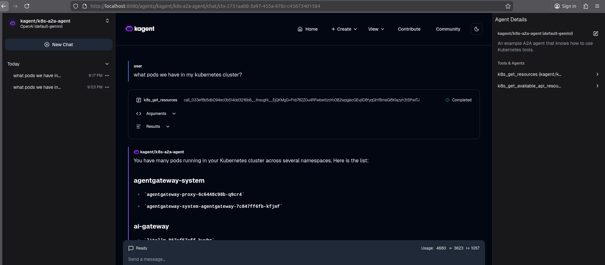

# AgenticNativePlatform

Cloud-native AI platform for Kubernetes-based agentic workloads with a GitOps-first operating model.

> **Current validation reality:** as of now, only the `local` topology has been tested end-to-end in a real run. The other supported topologies are present in the repository and should be treated as upcoming or operator-driven paths until they are revalidated.

## Start Here

- Overview architecture SVG: [`./.assets/architecture-current.svg`](./.assets/architecture-current.svg)
- Runtime architecture SVG: [`./.assets/architecture-current-runtime.svg`](./.assets/architecture-current-runtime.svg)
- GitOps/profile architecture SVG: [`./.assets/architecture-current-profiles.svg`](./.assets/architecture-current-profiles.svg)
- Runtime architecture source: [`./.assets/architecture-current-runtime.puml`](./.assets/architecture-current-runtime.puml)
- GitOps/profile architecture source: [`./.assets/architecture-current-profiles.puml`](./.assets/architecture-current-profiles.puml)
- Architecture notes: [`./docs/architecture.md`](./docs/architecture.md)
- Command reference: [`./docs/commands.md`](./docs/commands.md)
- Operations guide: [`./docs/OPERATIONS.md`](./docs/OPERATIONS.md)

The active staged bootstrap path is:

- `platform-bootstrap`
- `platform-infrastructure`
- `platform-applications`

The active composition layers are:

- bundles under `flux/components/bundles/`
- profiles under `flux/components/profiles/`
- generated cluster roots under `flux/generated/clusters/<cluster-id>/`
- optional Flux-managed child roots such as `platform-ops-ui` and `platform-samples`

## Architecture

**Human-oriented overview:**


**Current source of truth:** use the split PlantUML sources and their generated SVG renders:

- [`./.assets/architecture-current.svg`](./.assets/architecture-current.svg)
- [`./.assets/architecture-current-runtime.svg`](./.assets/architecture-current-runtime.svg)
- [`./.assets/architecture-current-profiles.svg`](./.assets/architecture-current-profiles.svg)
- [`./.assets/architecture-current-runtime.puml`](./.assets/architecture-current-runtime.puml)
- [`./.assets/architecture-current-profiles.puml`](./.assets/architecture-current-profiles.puml)

The overview SVG is a hand-curated summary. The split PlantUML files and their direct SVG renders remain the detailed source-backed views.

The runtime model in the repository is currently:

- `kgateway` is the public north-south entry point.
- `agentgateway` is the protocol-aware AI gateway.
- `kagent` uses `agentgateway` for both `/v1` and `/mcp`.
- `/v1` flows to `LiteLLM`, then to remote providers or an optional runtime overlay.
- `/mcp` flows to gateway-backed MCP targets such as `kagent-tools`.
- `kmcp` manages MCP server workloads.
- `KServe` remains installed in the serving stack, but it is not forced into the default `/v1` hot path.

<details>
<summary><strong>Open architecture notes and text fallback</strong></summary>

The PlantUML sources are intentionally split into two files for editor compatibility:

1. `architecture-current-runtime.puml` for runtime/data-path architecture with the main namespaces, pods, and services
2. `architecture-current-profiles.puml` for GitOps staging and profile composition

Text fallback:

```text
External clients
  -> kgateway
  -> agentgateway

kagent agents
  -> agentgateway /v1/...  -> LiteLLM -> remote providers and optional local runtimes
  -> agentgateway /mcp/... -> gateway-backed MCP targets

kmcp
  -> manages MCPServer workloads and transport

KServe
  -> remains installed for lightweight experiments and future self-hosted serving
```

Canonical MCP pattern in this repository:

```text
kagent -> RemoteMCPServer -> agentgateway -> MCP target
```

Current optional extras:

- `platform-ops-ui` renders `flux/components/weave-gitops/` as an optional Flux child root
- `platform-samples` renders `flux/components/samples-echo-mcp/` as an optional Flux child root
- both child roots are generated under `flux/generated/clusters/<cluster-id>/` and start suspended when not enabled

Detailed split SVG views:


Additional WBS views:

- [Runtime WBS SVG](./.assets/architecture-current-runtime-wbs.svg)
- [Profiles WBS SVG](./.assets/architecture-current-profiles-wbs.svg)
- [Runtime WBS PlantUML](./.assets/architecture-current-runtime-wbs.puml)
- [Profiles WBS PlantUML](./.assets/architecture-current-profiles-wbs.puml)

</details>

## Supported Topologies

**Important:** only `local` has real current test coverage. The other topologies are supported in code and generation, but practical validation is still pending.

| Topology | Intended cluster shape | Provisioning path | Current validation | Default profile | Practical operator access |
| --- | --- | --- | --- | --- | --- |
| `local` | single-node workstation `k3s` | OpenTofu/Terraform + Ansible + host-level `k3s` | tested | `platform-profile-full` | MetalLB and/or port-forward |
| `github-workspace` | single-node workspace `k3d` | generated `k3d` config + local tooling | not fully validated yet | `platform-profile-workspace` | port-forward first |
| `minipc` | single-node remote `k3s` | OpenTofu/Terraform + Ansible | not fully validated yet | `platform-profile-full` | LAN / MetalLB style access |
| `hybrid` | miniPC control plane + local worker | OpenTofu/Terraform + Ansible | not fully validated yet | `platform-profile-full` | LAN / MetalLB style access |
| `hybrid-remote` | miniPC control plane + local + remote workers | OpenTofu/Terraform + Ansible | not fully validated yet | `platform-profile-full` | LAN / MetalLB style access |

<details>
<summary><strong>Open recommended topology and profile configuration matrix</strong></summary>

### Recommended topology/profile combinations

| Topology | `PLATFORM_PROFILE` | Recommended when | Recommended settings |
| --- | --- | --- | --- |
| `local` | `platform-profile-full` | default real workstation bootstrap | `TOPOLOGY=local ENV=dev RUNTIME=none SECRETS_MODE=external LMSTUDIO_ENABLED=false IAC_TOOL=tofu` |
| `local` | `platform-profile-fast` | quickest agent stack without serving/context/observability | `TOPOLOGY=local ENV=dev RUNTIME=none SECRETS_MODE=external LMSTUDIO_ENABLED=false PLATFORM_PROFILE=platform-profile-fast IAC_TOOL=tofu` |
| `local` | `platform-profile-fast-serving` | lighter stack with serving experiments | `TOPOLOGY=local ENV=dev RUNTIME=none SECRETS_MODE=external LMSTUDIO_ENABLED=false PLATFORM_PROFILE=platform-profile-fast-serving IAC_TOOL=tofu` |
| `local` | `platform-profile-fast-context` | lighter stack with context services | `TOPOLOGY=local ENV=dev RUNTIME=none SECRETS_MODE=external LMSTUDIO_ENABLED=false PLATFORM_PROFILE=platform-profile-fast-context IAC_TOOL=tofu` |
| `github-workspace` | `platform-profile-workspace` | current intended workspace default | `TOPOLOGY=github-workspace ENV=dev RUNTIME=none SECRETS_MODE=external LMSTUDIO_ENABLED=false IAC_TOOL=tofu` |
| `github-workspace` | `platform-profile-fast` | leaner workspace experiment without serving stack | `TOPOLOGY=github-workspace ENV=dev RUNTIME=none SECRETS_MODE=external LMSTUDIO_ENABLED=false PLATFORM_PROFILE=platform-profile-fast IAC_TOOL=tofu` |
| `github-workspace` | `platform-profile-fast-serving` | explicit serving-capable workspace profile | `TOPOLOGY=github-workspace ENV=dev RUNTIME=none SECRETS_MODE=external LMSTUDIO_ENABLED=false PLATFORM_PROFILE=platform-profile-fast-serving IAC_TOOL=tofu` |
| `minipc` | `platform-profile-full` | remote single-node home-lab | `TOPOLOGY=minipc ENV=dev RUNTIME=none SECRETS_MODE=external LMSTUDIO_ENABLED=false IAC_TOOL=tofu` |
| `hybrid` | `platform-profile-full` | multi-node control-plane plus workstation worker | `TOPOLOGY=hybrid ENV=dev RUNTIME=none SECRETS_MODE=external LMSTUDIO_ENABLED=false IAC_TOOL=tofu` |
| `hybrid-remote` | `platform-profile-full` | larger mixed-node environment | `TOPOLOGY=hybrid-remote ENV=dev RUNTIME=none SECRETS_MODE=external LMSTUDIO_ENABLED=false IAC_TOOL=tofu` |

### Profile meaning

| Profile | Current composition | Main included components / pods | Typical use |
| --- | --- | --- | --- |
| `platform-profile-full` | `platform-base + platform-network + platform-agent-runtime + platform-serving + platform-context + platform-observability + metallb` | `cert-manager`, `istiod`, `istio-cni`, `ztunnel`, `kgateway`, `agentgateway`, `litellm`, `kagent-controller`, `kagent-ui`, `kagent-tools`, `kmcp-controller-manager`, `kserve`, `tei-embeddings`, `qdrant`, `postgres`, `redis`, `prometheus`, `grafana`, `loki`, `metallb` | full local or host-based environment |
| `platform-profile-fast` | `platform-base + platform-network + platform-agent-runtime + metallb` | `cert-manager`, `istiod`, `istio-cni`, `ztunnel`, `kgateway`, `agentgateway`, `litellm`, `kagent-controller`, `kagent-ui`, `kagent-tools`, `kmcp-controller-manager`, `metallb` | quickest agent-focused stack |
| `platform-profile-fast-serving` | `platform-profile-fast + platform-serving` | everything from `platform-profile-fast`, plus `kserve` and `tei-embeddings`, and the optional runtime overlay path for `ollama` or `vllm` when selected | light serving checks |
| `platform-profile-fast-context` | `platform-profile-fast + platform-context` | everything from `platform-profile-fast`, plus `qdrant`, `postgres`, and `redis` | light context checks |
| `platform-profile-workspace` | currently aliases `platform-profile-fast-serving` | currently the same component set as `platform-profile-fast-serving`; in the current repo state that means the workspace profile inherits the fast stack, serving stack, and the profile-level `metallb` inclusion from `platform-profile-fast` | workspace-oriented default |

</details>

## Quick Start

**Recommended first run:** keep the platform simple and use the default remote-provider path first.

```bash
cp .env.example .env
# edit .env for your machine and real credentials
make run-cluster-from-scratch TOPOLOGY=local ENV=dev RUNTIME=none SECRETS_MODE=external LMSTUDIO_ENABLED=false IAC_TOOL=tofu
```

That is the preferred path for a first real bootstrap.

## Secrets Mode: Start Without SOPS, Then Migrate

**Recommended first bootstrap:** start with `SECRETS_MODE=external`, get the platform healthy, and only then migrate to `SECRETS_MODE=sops`.

Why this is the current recommended order:

- first bootstrap has fewer moving parts
- Flux decryption is not an early dependency
- provider keys and startup issues are easier to debug
- you validate the platform first, then harden secret storage second

### First bootstrap: use `external`

Use:

```env
SECRETS_MODE=external
```

Apply the generated plaintext secret objects:

```bash
make apply-plaintext-secrets ENV=dev
```

This is the intended current first-run path.

### Later: migrate to `sops`

After the platform is healthy, move to encrypted repo-managed secrets:

```bash
make sops-age-key
make render-sops-secrets ENV=dev
make encrypt-secrets ENV=dev
make sops-bootstrap-cluster
make render-cluster-root TOPOLOGY=$TOPOLOGY ENV=dev RUNTIME=$RUNTIME SECRETS_MODE=sops LMSTUDIO_ENABLED=$LMSTUDIO_ENABLED PLATFORM_PROFILE=${PLATFORM_PROFILE:-}
```

Then update your active settings:

```env
SECRETS_MODE=sops
```

Migration summary:

1. create an age key
2. render plaintext inputs under `.generated/secrets/<env>/`
3. encrypt them into `flux/secrets/<env>/`
4. bootstrap the decryption secret into `flux-system`
5. regenerate the cluster root with `SECRETS_MODE=sops`
6. commit and push the tracked secret artifacts that Flux should read

<details>
<summary><strong>Open practical notes for the external-to-SOPS migration</strong></summary>

- `external` is for easier bootstrap and troubleshooting, not the final hardened state
- `.generated/` remains local and must not be committed
- `flux/secrets/<env>/` is the tracked GitOps path when using `SECRETS_MODE=sops`
- after switching to SOPS, Flux still reconciles the same staged roots, but now reads encrypted secret manifests from the repo

</details>

<details>
<summary><strong>Open what the quick start does</strong></summary>

`make run-cluster-from-scratch` performs the current staged bootstrap flow:

1. installs local operator tools
2. provisions the selected topology
3. renders tracked Flux inputs under `flux/generated/...`
4. installs Flux controllers
5. applies the initial secret mode
6. applies the rendered `bootstrap-flux` path
7. reconciles the staged platform roots
8. prints cluster status

Notes:

- the repository is GitOps-first, so Flux reads the remote Git branch, not the local working tree
- the one-command target is still the preferred user flow even though bootstrap application remains a thin shell wrapper over declaratively rendered manifests
- the first cold bootstrap can take a long time because Helm pulls images, PVCs are created, and some controllers have long startup budgets

</details>

<details>
<summary><strong>Open resume steps after a partial bootstrap</strong></summary>

If the one-command run stopped after Flux installation but before the staged Git bootstrap completed:

```bash
make apply-plaintext-secrets ENV=dev
make bootstrap-flux-git TOPOLOGY=$TOPOLOGY ENV=dev RUNTIME=none SECRETS_MODE=external LMSTUDIO_ENABLED=false PLATFORM_PROFILE=${PLATFORM_PROFILE:-}
make reconcile
make cluster-status
```

</details>

## Step-by-step Install and Bootstrap

**Use this section when you do not want the quick start and want the more precise manual path instead.**

The manual flow is:

1. install local operator tools
2. choose the topology
3. bring up the cluster
4. install Flux
5. apply the initial secret mode
6. bootstrap the Git source and reconcile the staged roots

<details>
<summary><strong>Open precise manual flow for the tested `local` topology</strong></summary>

```bash
cp .env.example .env
make tools-install-local IAC_TOOL=tofu INSTALL_K9S=true
make terraform-init TOPOLOGY=local TF_BIN=tofu
make terraform-apply TOPOLOGY=local TF_BIN=tofu
make bootstrap-hosts TOPOLOGY=local
make install-k3s-server TOPOLOGY=local
make kubeconfig TOPOLOGY=local
make install-flux-local
make apply-plaintext-secrets ENV=dev
make bootstrap-flux-git TOPOLOGY=local ENV=dev RUNTIME=none SECRETS_MODE=external LMSTUDIO_ENABLED=false
make reconcile
make verify
make cluster-status
```

</details>

<details>
<summary><strong>Open precise manual flow for `github-workspace`</strong></summary>

```bash
cp .env.example .env
make tools-install-local IAC_TOOL=tofu INSTALL_K9S=false
make cluster-up-github-workspace TOPOLOGY=github-workspace ENV=dev RUNTIME=none SECRETS_MODE=external LMSTUDIO_ENABLED=false
make install-flux-local
make apply-plaintext-secrets ENV=dev
make bootstrap-flux-git TOPOLOGY=github-workspace ENV=dev RUNTIME=none SECRETS_MODE=external LMSTUDIO_ENABLED=false
make reconcile
make verify
make cluster-status
```

Current note: this topology is present in generation and automation, but it still does not have the same real validation level as `local`.

</details>

<details>
<summary><strong>Open quick lifecycle commands</strong></summary>

Pause platform workloads without deleting the cluster:

```bash
make cluster-pause
```

Resume:

```bash
make cluster-resume
```

Remove only the cluster:

```bash
make cluster-remove TOPOLOGY=$TOPOLOGY
```

Remove the cluster and topology infrastructure:

```bash
make environment-destroy TOPOLOGY=$TOPOLOGY TF_BIN=tofu
```

</details>

## Configuration Reference

**Open the full parameter and environment-variable reference:** this replaces the old "Meaning of the main variables" section and keeps the current user-facing knobs in one place.

<details>
<summary><strong>Open configuration parameters and environment variables</strong></summary>

| Parameter / env variable | What it means | Used in command or setting | Example of usage / change | Possible values |
| --- | --- | --- | --- | --- |
| `TOPOLOGY` | Selects the infrastructure shape and generated paths | `make run-cluster-from-scratch`, `render-terraform-tfvars.sh`, `render-cluster-kustomization.sh` | `make run-cluster-from-scratch TOPOLOGY=local` | `local`, `github-workspace`, `minipc`, `hybrid`, `hybrid-remote` |
| `ENV` | Selects the overlay and secret environment | `render-cluster-kustomization.sh`, secret render targets | `make apply-plaintext-secrets ENV=dev` | usually `dev`, also any overlay/secret env you maintain |
| `PLATFORM_PROFILE` | Overrides the topology default staged profile | `make render-cluster-root`, `make bootstrap-flux-git`, Terraform flux-manifest-generator | `make profile-fast` or `make reconcile PLATFORM_PROFILE=platform-profile-fast` | empty for default, `platform-profile-full`, `platform-profile-fast`, `platform-profile-fast-serving`, `platform-profile-fast-context`, `platform-profile-workspace` |
| `RUNTIME` | Selects the optional in-cluster chat runtime overlay | `render-cluster-kustomization.sh`, `make bootstrap-flux-git` | `make bootstrap-flux-git RUNTIME=vllm ...` | `none`, `ollama`, `vllm` |
| `LMSTUDIO_ENABLED` | Enables the external LM Studio integration path | generated Flux inputs and runtime values | `make bootstrap-flux-git LMSTUDIO_ENABLED=true ...` | `true`, `false` |
| `SECRETS_MODE` | Chooses bootstrap secret handling mode | cluster root generation and secret targets | `make render-cluster-root SECRETS_MODE=sops ...` | `external`, `sops` |
| `IAC_TOOL` | Selects which IaC CLI the Makefile should prefer | `make tools-install-local`, `TF_BIN` defaulting | `make tools-install-local IAC_TOOL=terraform` | `tofu`, `terraform` |
| `TF_BIN` | Explicit binary used for Terraform/OpenTofu commands | `terraform-init`, `terraform-apply`, `environment-destroy` | `make terraform-apply TF_BIN=tofu` | `tofu`, `terraform` |
| `PLATFORM_ENABLE_WEAVE_GITOPS_UI` | Enables the optional Flux-managed Weave GitOps child root | cluster root generation and bootstrap | `make bootstrap-flux-git PLATFORM_ENABLE_WEAVE_GITOPS_UI=true ...` | `true`, `false` |
| `PLATFORM_ENABLE_SAMPLES_ECHO_MCP` | Enables the optional Flux-managed sample MCP child root | cluster root generation and bootstrap | `make bootstrap-flux-git PLATFORM_ENABLE_SAMPLES_ECHO_MCP=true ...` | `true`, `false` |
| `GIT_REPO_URL` | Remote Git repository that Flux reads from | `bootstrap-flux-git`, Flux `GitRepository/platform` render | `GIT_REPO_URL=https://github.com/<user>/<repo>.git` | any Git URL Flux can reach |
| `GIT_BRANCH` | Remote branch Flux should reconcile | `bootstrap-flux-git`, Flux `GitRepository/platform` render | `GIT_BRANCH=main` | any branch name |
| `LOCAL_HOST_IP` | Workstation IP used by `local` and LM Studio defaults | Terraform inventory generation, local topology data | `LOCAL_HOST_IP=192.168.1.108` | valid host IP |
| `MINIPC_IP`, `REMOTE_WORKER_IP` | Remote node addresses for host-based multi-node topologies | inventory generation and Ansible | `MINIPC_IP=192.168.1.50` | valid host IPs |
| `SSH_PRIVATE_KEY` | SSH key used by Ansible on remote nodes | Ansible bootstrap and kubeconfig export | `SSH_PRIVATE_KEY=~/.ssh/id_ed25519` | filesystem path |
| `K3S_VERSION` | k3s version used for host-level clusters | inventory generation and Ansible installs | `K3S_VERSION=v1.34.5+k3s1` | supported k3s version string |
| `CLUSTER_DOMAIN` | Internal Kubernetes DNS suffix | rendered topology and service assumptions | `CLUSTER_DOMAIN=cluster.local` | usually `cluster.local` or another internal suffix |
| `METALLB_START`, `METALLB_END` | Address range for rendered MetalLB pool values on host-based topologies | generated MetalLB manifests | `METALLB_START=192.168.1.240` | valid address range for your LAN |
| `BASE_DOMAIN` | Friendly LAN DNS suffix you want to use | operator-facing naming and documentation workflow | `BASE_DOMAIN=home.arpa` | any LAN/public suffix you manage |
| `GOOGLE_API_KEY` | Default Gemini provider key | LiteLLM provider secret render | `GOOGLE_API_KEY=...real-key...` | real credential |
| `GEMINI_MODEL` | Default Gemini model alias | generated `litellm-values-configmap.yaml` | `GEMINI_MODEL=gemini-3.1-flash-lite-preview` | provider model string |
| `OPENAI_API_KEY`, `ANTHROPIC_API_KEY`, `AWS_*`, `VERTEX_*` | Optional provider credentials | provider secret render and LiteLLM routing | `OPENAI_API_KEY=...` | real credentials for the chosen provider |
| `LMSTUDIO_HOST_IP`, `LMSTUDIO_PORT`, `LMSTUDIO_CHAT_MODEL`, `LMSTUDIO_EMBEDDING_MODEL` | External LM Studio endpoint and model names | rendered LM Studio endpoint and LiteLLM values | `LMSTUDIO_ENABLED=true LMSTUDIO_PORT=1234` | valid endpoint and model strings |
| `EMBEDDING_MODEL` | TEI embedding model | generated `tei-values-configmap.yaml` | `EMBEDDING_MODEL=onnx-models/all-MiniLM-L6-v2-onnx` | ONNX-backed embedding model is recommended |
| `OLLAMA_VERSION`, `OLLAMA_DEFAULT_MODEL` | Ollama runtime version and default model | Ollama overlay generation | `make bootstrap-flux-git RUNTIME=ollama OLLAMA_DEFAULT_MODEL=qwen2.5:7b-instruct ...` | valid Ollama version/model |
| `VLLM_MODEL`, `VLLM_IMAGE`, `VLLM_CPU_*`, `VLLM_LD_PRELOAD` | vLLM runtime image and tuning | vLLM overlay generation | `make bootstrap-flux-git RUNTIME=vllm VLLM_IMAGE=public.ecr.aws/...:v0.18.0 ...` | pinned image tag and runtime tuning values |
| `ECHO_MCP_IMAGE` | Image tag for the optional sample `echo-mcp` MCP server | `samples-echo-mcp` generated values | `make bootstrap-flux-git PLATFORM_ENABLE_SAMPLES_ECHO_MCP=true ECHO_MCP_IMAGE=echo-mcp:local ...` | imported local tag or pinned remote tag |
| `LITELLM_MASTER_KEY` | Auth header value for LiteLLM and current AgentGateway OpenAI checks | plaintext/SOPS secret render, `check-litellm`, `check-agentgateway-openai` | `LITELLM_MASTER_KEY=my-key make test-litellm` | random/generated or explicit secret |
| `PLATFORM_POSTGRES_PASSWORD` | Explicit PostgreSQL application password override | plaintext/SOPS secret render | `PLATFORM_POSTGRES_PASSWORD=strong-secret` | real secret |
| `GRAFANA_ADMIN_USERNAME`, `GRAFANA_ADMIN_PASSWORD` | Grafana admin bootstrap credentials | observability secret render | `GRAFANA_ADMIN_PASSWORD=strong-secret` | real username/password |
| `WEAVE_GITOPS_ADMIN_USERNAME`, `WEAVE_GITOPS_ADMIN_PASSWORD`, `WEAVE_GITOPS_ADMIN_PASSWORD_HASH` | Optional Weave GitOps UI bootstrap credentials | Weave GitOps secret render when UI is enabled | `PLATFORM_ENABLE_WEAVE_GITOPS_UI=true WEAVE_GITOPS_ADMIN_PASSWORD=...` | username plus plaintext password or bcrypt hash |
| `SOPS_AGE_RECIPIENT` | Age recipient used for encrypted secret generation | `render-sops-secrets`, `encrypt-secrets` | `SOPS_AGE_RECIPIENT=age1...` | valid age recipient |
| `KAGENT_UI_LOCAL_PORT`, `KAGENT_A2A_LOCAL_PORT`, `AGENTGATEWAY_LOCAL_PORT`, `LITELLM_LOCAL_PORT`, `GRAFANA_LOCAL_PORT`, `PROMETHEUS_LOCAL_PORT`, `QDRANT_LOCAL_PORT` | Local port overrides for port-forward targets | `open-*` Make targets | `make open-kagent-ui KAGENT_UI_LOCAL_PORT=18080` | valid unused local TCP ports |

</details>

## GitOps Flow And Repository Rules

**The most important rule:** Flux reconciles the remote repository state, not your local working tree.

<details>
<summary><strong>Open current GitOps flow</strong></summary>

### Current staged flow

1. Edit source manifests, charts, overlays, or runtime inputs in the repository.
2. Regenerate tracked GitOps inputs when topology/runtime/profile values changed.
3. Validate the generated output locally.
4. Commit and push both source changes and generated manifests.
5. Bootstrap or reconcile Flux against the remote branch.
6. Let Flux drive the staged roots in order.

### Current stage meaning

| Stage | Current purpose |
| --- | --- |
| `platform-bootstrap` | namespaces, sources, generated ConfigMaps, secret references, base bootstrap content |
| `platform-infrastructure` | selected profile infrastructure plus runtime overlay |
| `platform-applications` | profile applications plus env overlay and generated host artifacts where applicable |
| `platform-ops-ui` | optional Flux child root for Weave GitOps UI |
| `platform-samples` | optional Flux child root for the `echo-mcp` sample bundle |

### Practical workflow

```bash
make flux-values TOPOLOGY=$TOPOLOGY
make render-cluster-root TOPOLOGY=$TOPOLOGY ENV=$ENV RUNTIME=$RUNTIME SECRETS_MODE=$SECRETS_MODE PLATFORM_PROFILE=${PLATFORM_PROFILE:-}
kubectl kustomize flux/generated/clusters/${TOPOLOGY}-${ENV}-${RUNTIME}-${SECRETS_MODE}
git add flux/generated
git commit -m "Update generated Flux inputs"
git push
make bootstrap-flux-git TOPOLOGY=$TOPOLOGY ENV=$ENV RUNTIME=$RUNTIME SECRETS_MODE=$SECRETS_MODE PLATFORM_PROFILE=${PLATFORM_PROFILE:-} LMSTUDIO_ENABLED=${LMSTUDIO_ENABLED:-false}
make reconcile
```

### Current repository rules

Commit:

- `charts/`
- `flux/components/`
- `flux/overlays/`
- `flux/generated/<topology>/`
- `flux/generated/clusters/<topology>-<env>-<runtime>-<secrets-mode>/`
- `flux/secrets/<env>/` only when using `SECRETS_MODE=sops`
- `docs/`
- `scripts/`
- `mcp/`

Do not commit:

- `.env`
- `.kube/generated/`
- `.generated/`
- `ansible/generated/`
- local `terraform.auto.tfvars`
- local SOPS private keys

Generated behavior to remember:

- `make kubeconfig` writes `.kube/generated/current.yaml`
- repo Make targets bind `kubectl` and `flux` to that kubeconfig
- `flux/generated/<topology>/topology-values.yaml` is operator metadata only and must not be applied to Kubernetes
- `bootstrap-flux` is rendered under `flux/generated/clusters/<cluster-id>/bootstrap-flux/` and then applied by the thin wrapper

</details>

## Runtime, Secrets, And Optional Components

**Recommended first boot mode:** `RUNTIME=none`, `SECRETS_MODE=external`, `LMSTUDIO_ENABLED=false`.

<details>
<summary><strong>Open runtime switching examples</strong></summary>

Remote provider only:

```bash
make bootstrap-flux-git TOPOLOGY=$TOPOLOGY ENV=dev RUNTIME=none SECRETS_MODE=external LMSTUDIO_ENABLED=false
make reconcile
```

Remote provider plus external LM Studio:

```bash
make bootstrap-flux-git TOPOLOGY=$TOPOLOGY ENV=dev RUNTIME=none SECRETS_MODE=external LMSTUDIO_ENABLED=true
make reconcile
```

Remote provider plus Ollama:

```bash
make bootstrap-flux-git TOPOLOGY=$TOPOLOGY ENV=dev RUNTIME=ollama SECRETS_MODE=external LMSTUDIO_ENABLED=false
make reconcile
```

Remote provider plus vLLM:

```bash
make bootstrap-flux-git TOPOLOGY=$TOPOLOGY ENV=dev RUNTIME=vllm SECRETS_MODE=external LMSTUDIO_ENABLED=false
make reconcile
```

Current note:

- `KServe` remains installed in the serving stack
- it is not the default `/v1` path
- for a lightweight KServe validation, use `flux/components/kserve/samples/hf-tiny-inferenceservice.yaml`

</details>

<details>
<summary><strong>Open secrets flow: external first, SOPS later</strong></summary>

Initial bootstrap:

```env
SECRETS_MODE=external
```

```bash
make apply-plaintext-secrets ENV=dev
```

Why start this way:

- fewer moving parts during first bootstrap
- no decryption dependency inside Flux yet
- easier provider-key debugging

Move later to SOPS:

```bash
make sops-age-key
make render-sops-secrets ENV=dev
make encrypt-secrets ENV=dev
make sops-bootstrap-cluster
make render-cluster-root TOPOLOGY=$TOPOLOGY ENV=dev RUNTIME=none SECRETS_MODE=sops LMSTUDIO_ENABLED=false
```

SOPS sequence:

1. create the local age key
2. render plaintext inputs under `.generated/secrets/<env>/`
3. encrypt them into `flux/secrets/<env>/`
4. bootstrap the decryption secret into `flux-system`
5. switch generated roots to `SECRETS_MODE=sops`

</details>

<details>
<summary><strong>Open optional component enablement</strong></summary>

### Optional Weave GitOps UI

This is now an optional Flux-managed child root instead of a manual `kubectl apply -k` path.

```bash
make bootstrap-flux-git TOPOLOGY=$TOPOLOGY ENV=dev RUNTIME=none SECRETS_MODE=external LMSTUDIO_ENABLED=false PLATFORM_ENABLE_WEAVE_GITOPS_UI=true
make reconcile
```

Rendered path:

```text
flux/generated/clusters/<topology>-<env>-<runtime>-<secrets-mode>/weave-gitops
```

### Optional `echo-mcp` sample

This is also a Flux-managed optional child root.

```bash
make bootstrap-flux-git TOPOLOGY=$TOPOLOGY ENV=dev RUNTIME=none SECRETS_MODE=external LMSTUDIO_ENABLED=false PLATFORM_ENABLE_SAMPLES_ECHO_MCP=true ECHO_MCP_IMAGE=echo-mcp:local
make reconcile
```

Rendered path:

```text
flux/generated/clusters/<topology>-<env>-<runtime>-<secrets-mode>/samples-echo-mcp
```

Current note:

- the default MCP validation path is still the bundled `kagent-tool-server` route
- the optional sample should be enabled only when you explicitly want the demo MCP server

</details>

## Access, Operations, And Troubleshooting

**Normal local operator entrypoint:** `make open-research-access`

<details>
<summary><strong>Open local access paths and endpoint behavior</strong></summary>

Open all standard local access paths:

```bash
make open-research-access
```

This currently attempts the standard port-forwards that exist in the cluster and then prints a summary.

Main local URLs:

- `http://localhost:8080` for the `kagent` UI
- `http://localhost:8083/api/a2a/kagent/k8s-a2a-agent/.well-known/agent.json` for the sample A2A card
- `http://localhost:15000/v1/models` for `agentgateway`
- `http://localhost:15000/mcp/kagent-tools` for the bundled MCP route through `agentgateway`
- `http://localhost:4000/health/readiness` for LiteLLM readiness
- `http://localhost:4000/v1/models` for LiteLLM
- `http://localhost:3000` for Grafana
- `http://localhost:9090` for Prometheus
- `http://localhost:6333/dashboard` for Qdrant

Endpoint truth table:

| URL | Expected behavior |
| --- | --- |
| `http://localhost:15000/` | no root route is expected |
| `http://localhost:15000/v1/models` | AgentGateway OpenAI-compatible API |
| `http://localhost:15000/mcp/kagent-tools` | bundled MCP route through AgentGateway |
| `http://localhost:4000/health/readiness` | LiteLLM readiness endpoint |
| `http://localhost:4000/v1/models` | LiteLLM API |

Single-target examples:

```bash
make open-kagent-ui
make open-kagent-a2a
make open-agentgateway
make open-litellm
make open-grafana
make open-prometheus
make open-qdrant
```

Port override examples:

```bash
make open-kagent-ui KAGENT_UI_LOCAL_PORT=18080
make open-kagent-a2a KAGENT_A2A_LOCAL_PORT=18083
make open-agentgateway AGENTGATEWAY_LOCAL_PORT=16000
make open-litellm LITELLM_LOCAL_PORT=14000
make open-grafana GRAFANA_LOCAL_PORT=13000
make open-prometheus PROMETHEUS_LOCAL_PORT=19090
make open-qdrant QDRANT_LOCAL_PORT=16333
```

API tests:

```bash
make check-agentgateway
make check-agentgateway-openai
make check-litellm
make test-agentgateway-openai
make test-litellm
```

</details>

<details>
<summary><strong>Open LAN/internet access notes</strong></summary>

For host-based topologies, the canonical external service is `agentgateway-proxy`.

When that service has a reachable address, the external AgentGateway endpoint is:

```text
http://<reachable-ip>:8080/v1/models
```

For friendly names on your LAN:

1. choose `BASE_DOMAIN`
2. point local DNS or `/etc/hosts` entries at the reachable IP
3. use `kgateway` and `agentgateway` through those names

Internet exposure still requires infrastructure outside this repository:

- public routing or exposure method
- DNS that resolves to the reachable IP
- firewall or router rules

</details>

<details>
<summary><strong>Open pause/resume and troubleshooting notes</strong></summary>

Pause without removing the cluster:

```bash
make cluster-pause
```

Resume and inspect:

```bash
make cluster-resume
make cluster-status
make diagnose-runtime-state
make recover-paused-workloads
```

Basic verification:

```bash
make verify
make check-flux-stages
make check-agentgateway
make check-litellm
make cluster-status
```

Direct inspection:

```bash
make k9s-local
kubectl --kubeconfig .kube/generated/current.yaml get pods -A
flux --kubeconfig .kube/generated/current.yaml get kustomizations -A
flux --kubeconfig .kube/generated/current.yaml get helmreleases -A
```

Recommended validation order:

1. validate the default remote-provider path first
2. validate MCP through the bundled `kagent-tool-server` route
3. validate KServe through `flux/components/kserve/samples/hf-tiny-inferenceservice.yaml`
4. only then move to heavier self-hosted runtime experiments

If LiteLLM, PostgreSQL, Qdrant, Redis, or TEI appear to be missing after a pause/resume cycle, treat it as runtime state first:

```bash
make diagnose-runtime-state
```

</details>


## Visual Examples of work:

call help documentation:


qick start of the cluster:


k9s monitoring (make k9s-local):


make open-research-access:


kagent UI (previously run make open-kagent-ui or make open-research-access -- see above):


And other steps:
- [make-open-kagent-ui4](.assets/kagent-ui4.png)
- [make-open-kagent-ui5](.assets/kagent-ui5.png)
- [make-open-kagent-ui6](.assets/kagent-ui6.png)
- 
