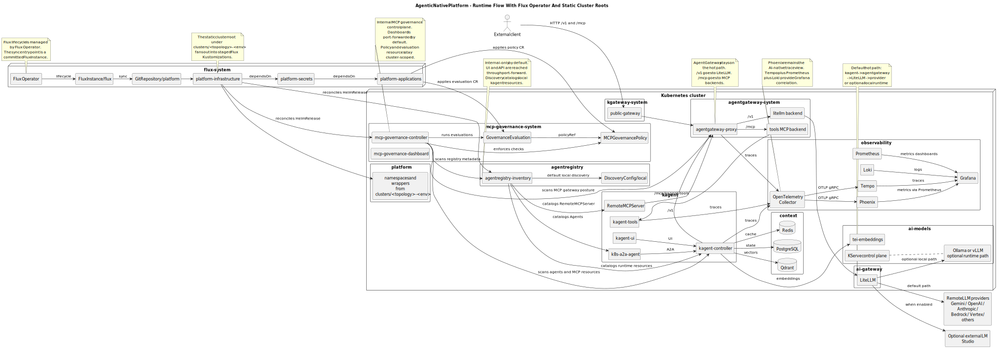
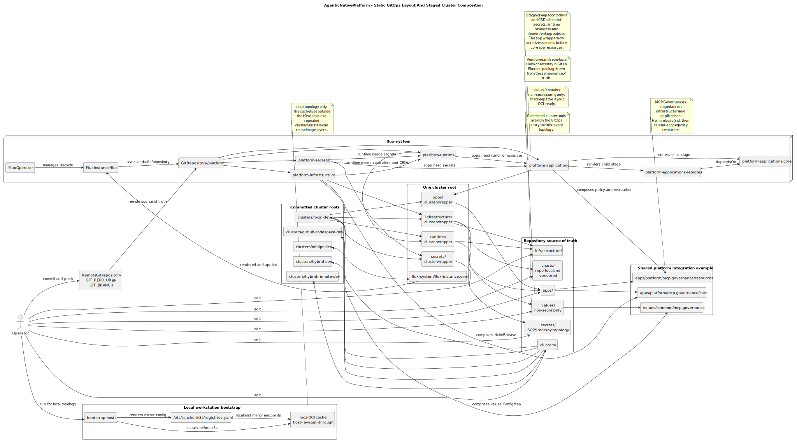
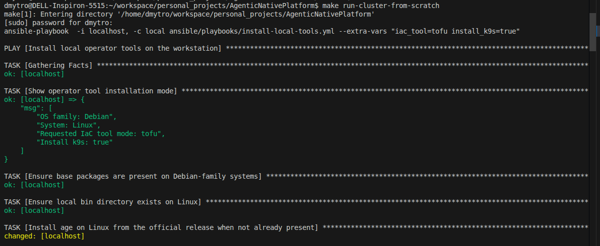
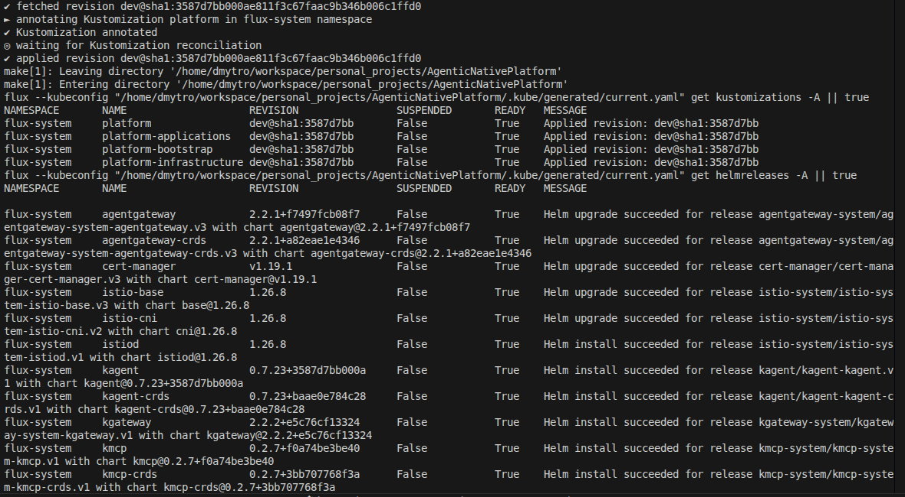
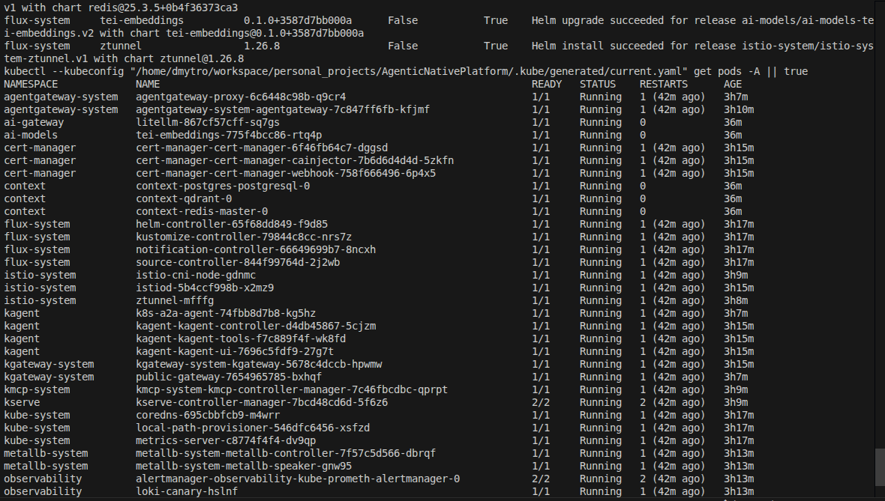

# AgenticNativePlatform

Cloud-native AI platform for Kubernetes-based agentic workloads with a GitOps-first operating model.

> **Current validation reality:** only the `local` topology has current end-to-end validation. The other topologies are present in code and automation, but should still be treated as operator-driven paths until they are revalidated.

## Start Here

- Overview architecture SVG: [`./.assets/architecture-current.svg`](./.assets/architecture-current.svg)
- Runtime architecture SVG: [`./.assets/architecture-current-runtime.svg`](./.assets/architecture-current-runtime.svg)
- Layout and staged GitOps SVG: [`./.assets/architecture-current-profiles.svg`](./.assets/architecture-current-profiles.svg)
- Runtime WBS SVG: [`./.assets/architecture-current-runtime-wbs.svg`](./.assets/architecture-current-runtime-wbs.svg)
- Layout WBS SVG: [`./.assets/architecture-current-profiles-wbs.svg`](./.assets/architecture-current-profiles-wbs.svg)
- Architecture notes: [`./docs/architecture.md`](./docs/architecture.md)
- Command reference: [`./docs/commands.md`](./docs/commands.md)
- Operations guide: [`./docs/OPERATIONS.md`](./docs/OPERATIONS.md)
- Example/demo notes: [`./docs/examples/demo.md`](./docs/examples/demo.md)

Recommended first run:

```bash
cp .env.example .env
# edit .env for your machine and real credentials
make run-cluster-from-scratch
```

## Architecture



The repository now uses:

- static Git-authored cluster roots under `clusters/<topology>-<env>/<secrets-mode>/`
- shared top-level trees under `infrastructure/`, `apps/`, `values/`, and `secrets/`
- Flux Operator to manage the Flux controller lifecycle
- a committed `FluxInstance` as the GitOps sync entrypoint
- three staged Flux `Kustomization` objects:
  - `platform-infrastructure`
  - `platform-secrets`
  - `platform-applications`

The runtime model in the repository is currently:

- `kgateway` is the public north-south entry point
- `agentgateway` is the protocol-aware AI gateway
- `kagent` uses `agentgateway` for both `/v1` and `/mcp`
- `agentregistry-inventory` is the internal control-plane registry for discovered agents, MCP servers, skills, and models
- `/v1` flows to `LiteLLM`, then to remote providers or optional local runtimes
- `/mcp` flows to gateway-backed MCP targets such as `kagent-tools`
- `KServe` remains part of the serving stack, but is not forced into the default `/v1` hot path

<details>
<summary><strong>Open Inventory control-plane integration</strong></summary>

The Inventory integration in this repository is intentionally conservative:

- upstream project author: Den Vasyliev
- upstream source repository: `https://github.com/den-vasyliev/agentregistry-inventory`
- Flux tracks branch `main` via `GitRepository/flux-system/agentregistry-inventory`
- the Helm release packages the upstream chart from `./charts/agentregistry`
- it installs in namespace `agentregistry`
- the only repo-local Inventory custom resource is the staged `DiscoveryConfig`
- it stays internal-only by default with a `ClusterIP` service and `make open-agentregistry-inventory`
- it ships a default local `DiscoveryConfig` that catalogs `kagent` `Agent`, `MCPServer`, `RemoteMCPServer`, and `ModelConfig` resources
- it is not added to the public `kgateway` listener by default, so existing topologies do not gain a new external surface during bootstrap

</details>

<details>
<summary><strong>Open architecture notes and text fallback</strong></summary>

The PlantUML sources are intentionally split into runtime and layout views:

1. `architecture-current-runtime.puml` for runtime/data-path architecture
2. `architecture-current-profiles.puml` for repository structure and staged Flux composition

Text fallback:

```text
external clients
  -> kgateway
  -> agentgateway

kagent agents
  -> agentgateway /v1/...  -> LiteLLM -> remote providers and optional local runtimes
  -> agentgateway /mcp/... -> gateway-backed MCP targets
```

Canonical MCP pattern in this repository:

```text
kagent -> RemoteMCPServer -> agentgateway -> MCP target
```

Inventory control-plane path:

```text
agentregistry-inventory -> discovers kagent Agents / MCPServer / RemoteMCPServer / ModelConfig
```

Detailed split SVG views:




Additional WBS views:

- [Runtime WBS SVG](./.assets/architecture-current-runtime-wbs.svg)
- [Layout WBS SVG](./.assets/architecture-current-profiles-wbs.svg)
- [Runtime WBS PlantUML](./.assets/architecture-current-runtime-wbs.puml)
- [Layout WBS PlantUML](./.assets/architecture-current-profiles-wbs.puml)

</details>

## Repository Layout

```text
AgenticNativePlatform/
├── Makefile
├── make-tasks/
├── bootstrap/
├── clusters/
├── infrastructure/
├── apps/
├── charts/
├── values/
├── secrets/
├── ansible/
├── terraform/
└── docs/
```

### Ownership boundaries

- `terraform/`: infra inputs, inventory generation, `k3d` config generation
- `ansible/`: host bootstrap, k3s install/export, one-time SOPS age bootstrap
- `bootstrap/flux-operator/`: declarative Flux Operator install artifacts
- `clusters/<topology>-<env>/`: committed cluster-specific bases, Flux templates, and mode-specific sync roots
- `charts/`: repo-local and vendored Helm charts used by Flux `HelmRelease` resources
- `infrastructure/`: sources, controllers, network, observability, security, storage
- `apps/`: platform and application manifests
- `values/`: non-secret Git-authored values and rendered ConfigMaps
- `secrets/`: committed SOPS roots by topology

## Supported Topologies

**Important:** only `local` has real current test coverage. The other topologies are supported in code and generation, but practical validation is still pending.

| Topology | Cluster root | Intended cluster shape | Provisioning path | Current validation | Practical operator access |
| --- | --- | --- | --- | --- | --- |
| `local` | `clusters/local-dev` | single-node workstation `k3s` | OpenTofu/Terraform + Ansible + host-level `k3s` | tested | MetalLB and/or port-forward |
| `github-codespace` | `clusters/github-codespace-dev` | single-node workspace `k3d` | generated `k3d` config + local tooling | not fully validated yet | port-forward first |
| `minipc` | `clusters/minipc-dev` | single-node remote `k3s` | OpenTofu/Terraform + Ansible | not fully validated yet | LAN / MetalLB style access |
| `hybrid` | `clusters/hybrid-dev` | miniPC control plane + local worker | OpenTofu/Terraform + Ansible | not fully validated yet | LAN / MetalLB style access |
| `hybrid-remote` | `clusters/hybrid-remote-dev` | miniPC control plane + local + remote workers | OpenTofu/Terraform + Ansible | not fully validated yet | LAN / MetalLB style access |

<details>
<summary><strong>Open topology notes and recommended first choices</strong></summary>

Recommended first bootstrap:

- `TOPOLOGY=local`
- `ENV=dev`
- `RUNTIME=none`
- `SECRETS_MODE=external`
- `LMSTUDIO_ENABLED=false`
- `IAC_TOOL=tofu`

Notes by topology:

- `local`: the canonical first-run path and the only topology with current real validation
- `github-codespace`: intended for GitHub Codespaces and other ephemeral developer environments using `k3d`
- `minipc`: remote single-node home-lab style deployment
- `hybrid`: miniPC control plane plus local workstation worker
- `hybrid-remote`: larger mixed-node environment with local and remote workers

</details>

## Quick Start

**Recommended first boot mode:** `RUNTIME=none`, `SECRETS_MODE=external`, `LMSTUDIO_ENABLED=false`.

```bash
cp .env.example .env
# edit .env for your machine and real credentials
make run-cluster-from-scratch
# or long version
make run-cluster-from-scratch TOPOLOGY=local ENV=dev RUNTIME=none SECRETS_MODE=external LMSTUDIO_ENABLED=false IAC_TOOL=tofu
```

That is the preferred path for a first real bootstrap.

Defaults used by the short form:

- `TOPOLOGY=local`
- `ENV=dev`
- `RUNTIME=none`
- `SECRETS_MODE=external`
- `LMSTUDIO_ENABLED=false`
- `IAC_TOOL=tofu`
- `LOCAL_OCI_CACHE_ENABLED=true` for `TOPOLOGY=local`

## Quick Lifecycle Commands

Pause platform workloads without deleting the cluster:

```bash
make cluster-pause
```

Resume:

```bash
make cluster-resume
make cluster-status
```

Destructive command meanings:

- `make cluster-pause`: scale application workloads down but keep the cluster and infrastructure so you can resume later
- `make remove-cluster-only`: delete the cluster but keep Terraform/OpenTofu infrastructure and other operator assets
- `make destroy-cluster-and-infra`: delete the cluster and also destroy Terraform/OpenTofu-managed infrastructure
- `make cluster-remove`: compatibility alias for `make remove-cluster-only`
- `make environment-destroy`: compatibility alias for `make destroy-cluster-and-infra`

Remove only the cluster but keep infrastructure/resources:

```bash
make remove-cluster-only TOPOLOGY=$TOPOLOGY
make cluster-remove TOPOLOGY=$TOPOLOGY
```

For `TOPOLOGY=local`, `make remove-cluster-only` also keeps the host-level OCI pull-through cache so the next `k3s` install can reuse cached image layers.

Remove the cluster and topology infrastructure:

```bash
make destroy-cluster-and-infra TOPOLOGY=$TOPOLOGY TF_BIN=tofu
make environment-destroy TOPOLOGY=$TOPOLOGY TF_BIN=tofu
```

For `TOPOLOGY=local`, `make destroy-cluster-and-infra` removes that OCI cache by default. If you want a full cluster teardown but want to keep the cached images on disk for the next rebuild:

```bash
make environment-destroy TOPOLOGY=local TF_BIN=tofu KEEP_LOCAL_OCI_CACHE=true
```

### First-run note: why bootstrap may stop on local GitOps diffs

Before cluster install continues, the bootstrap flow validates tracked GitOps inputs under:

- `values/<topology>/`
- `clusters/<topology>-<env>/`

If those tracked files differ from the current commit, bootstrap stops before Flux bootstrap continues. This is intentional.

- Flux reads the remote `GIT_REPO_URL` and `GIT_BRANCH`, not your unpublished local worktree
- `bootstrap-flux-instance` also refuses to continue when the worktree is dirty or local `HEAD` is not the same commit as the remote branch Flux will read
- if you intentionally changed topology-specific values or cluster-root content, commit and push first, then continue

Practical rule:

- no local-only tracked GitOps diffs: bootstrap continues
- tracked GitOps diffs present: commit and push first, then rerun `make run-cluster-from-scratch` or `make bootstrap-flux-instance`

### Local workstation note: network-interface changes can invalidate the cluster

For the single-node `local` topology, avoid switching the workstation between Wi-Fi and Ethernet while `k3s` is running or while a fresh bootstrap is still converging. The control-plane can keep the old workstation IP as the node `InternalIP`, which breaks cluster-internal API access even though `kubectl` on `127.0.0.1:6443` still works.

The local topology now also installs a small host-level OCI pull-through cache before `k3s` is created. `k3s` uses it as a registry mirror for the main registries used by this repo (`docker.io`, `ghcr.io`, `public.ecr.aws`, `cr.kgateway.dev`, `cr.agentgateway.dev`, and `cr.kagent.dev`). That means a later `make repair-local-k3s-network TOPOLOGY=local` or `make cluster-remove TOPOLOGY=local` followed by reinstall can usually reuse cached image layers instead of downloading them again from the internet.

This repo now fails fast on that condition during cluster-aware `make` targets. If you see a local k3s node-IP drift error, repair the runtime first:

```bash
make repair-local-k3s-network TOPOLOGY=local
make run-cluster-from-scratch TOPOLOGY=local ENV=dev SECRETS_MODE=sops
```

If the cluster runtime is back and you only need to resume GitOps/bootstrap steps, reinstall Flux Operator first, then restore the selected secret bootstrap mode, then apply the `FluxInstance`:

```bash
make repair-local-k3s-network TOPOLOGY=local
make recover-local-gitops TOPOLOGY=local ENV=dev SECRETS_MODE=sops
```

<details>
<summary><strong>Open what the quick start does</strong></summary>

`make run-cluster-from-scratch` performs the staged bootstrap flow:

1. installs local operator tools
2. provisions the selected topology
3. installs Flux Operator
4. applies the initial secret mode
5. applies a pinned `FluxInstance` pointing at the remote Git branch and committed cluster path
6. reconciles the staged platform roots
7. prints cluster status

Notes:

- the repository is GitOps-first, so Flux reads the remote Git branch, not the local working tree
- the first cold bootstrap can take a while because Helm pulls images, PVCs are created, and several controllers have long startup budgets
- for a first real bootstrap, keep the configuration simple and add optional runtimes later

</details>

<details>
<summary><strong>Open resume steps after a partial bootstrap</strong></summary>

If the one-command run stopped after Flux installation but before the staged Git bootstrap completed:

```bash
make apply-plaintext-secrets TOPOLOGY=local ENV=dev
make bootstrap-flux-instance TOPOLOGY=local ENV=dev
make reconcile
make cluster-status
```

If you are using `SECRETS_MODE=sops`, replace the plaintext step with:

```bash
make sops-bootstrap-cluster TOPOLOGY=local ENV=dev
```

</details>

## Step-By-Step Install And Bootstrap

Use this section when you want the manual flow instead of the one-command path.

The manual flow is:

1. install local operator tools
2. choose the topology
3. bring up the cluster
4. install Flux Operator
5. apply the initial secret mode
6. bootstrap the `FluxInstance`
7. reconcile the staged roots
8. verify and inspect the cluster

<details>
<summary><strong>Open precise manual flow for the tested `local` topology</strong></summary>

```bash
cp .env.example .env
make tools-install-local IAC_TOOL=tofu INSTALL_K9S=true
make terraform-init TOPOLOGY=local TF_BIN=tofu
make terraform-apply TOPOLOGY=local TF_BIN=tofu
make bootstrap-hosts TOPOLOGY=local
make install-k3s-server TOPOLOGY=local
make kubeconfig TOPOLOGY=local
make install-flux-local
make apply-plaintext-secrets TOPOLOGY=local ENV=dev
make bootstrap-flux-instance TOPOLOGY=local ENV=dev
make reconcile
make verify
make cluster-status
```

</details>

<details>
<summary><strong>Open local OCI cache notes</strong></summary>

The local topology enables a host-level OCI pull-through cache by default because repeated `k3s` reinstalls on a laptop otherwise re-pull a large part of the platform.

- install path: `make bootstrap-hosts TOPOLOGY=local`
- manual refresh: `make install-local-oci-cache TOPOLOGY=local`
- manual removal: `make uninstall-local-oci-cache TOPOLOGY=local`
- data root: `/var/lib/agentic-native-platform/oci-cache`
- disable for a run: `make ... TOPOLOGY=local LOCAL_OCI_CACHE_ENABLED=false`

The cache accelerates repeated container image pulls. It does not change the GitOps source of truth and does not try to preserve a broken running cluster after a workstation IP switch; use `make repair-local-k3s-network TOPOLOGY=local` for that case.

</details>

<details>
<summary><strong>Open precise manual flow for `github-codespace`</strong></summary>

```bash
cp .env.example .env
make tools-install-local IAC_TOOL=tofu INSTALL_K9S=false
make cluster-up-github-codespace TOPOLOGY=github-codespace
make kubeconfig TOPOLOGY=github-codespace
make install-flux-local
make apply-plaintext-secrets TOPOLOGY=github-codespace ENV=dev
make bootstrap-flux-instance TOPOLOGY=github-codespace ENV=dev
make reconcile
make verify
make cluster-status
```

Current note: this topology is present in generation and automation, but it still does not have the same real validation level as `local`.

</details>

## Configuration Reference

The main user-facing parameters are:

| Parameter / env variable | What it means | Typical usage | Example |
| --- | --- | --- | --- |
| `TOPOLOGY` | Selects the infrastructure shape and cluster root | bootstrap and lifecycle targets | `make run-cluster-from-scratch TOPOLOGY=local` |
| `ENV` | Selects the environment suffix and secret scope | secret and Flux bootstrap targets | `make bootstrap-flux-instance TOPOLOGY=local ENV=dev` |
| `RUNTIME` | Selects the optional local runtime mode | operational bootstrap/reconcile flow | `RUNTIME=ollama` or `RUNTIME=vllm` |
| `LMSTUDIO_ENABLED` | Enables the external LM Studio integration path | local or external model routing | `LMSTUDIO_ENABLED=true` |
| `SECRETS_MODE` | Chooses bootstrap secret handling mode | plaintext-first or SOPS flow | `SECRETS_MODE=external` or `SECRETS_MODE=sops` |
| `IAC_TOOL` / `TF_BIN` | Selects OpenTofu or Terraform | tool and infra targets | `IAC_TOOL=tofu` |
| `GIT_REPO_URL` / `GIT_BRANCH` | Remote repository and branch Flux reads | `bootstrap-flux-instance` and CI | `GIT_BRANCH=main` |
| `FLUX_INSTANCE_SYNC_PATH` | Git path used by `FluxInstance.spec.sync.path` | local or CI override | `FLUX_INSTANCE_SYNC_PATH=./clusters/local-dev` |
| `FLUX_OPERATOR_VERSION` / `FLUX_VERSION` | Pinned bootstrap versions | Flux Operator install and `FluxInstance` render | `FLUX_VERSION=2.8.3` |
| provider and runtime vars | credentials, LM Studio endpoint, embedding model, Ollama/vLLM values | secret render and runtime settings | see `.env.example` |

<details>
<summary><strong>Open full practical variable notes</strong></summary>

| Parameter / env variable | What it means | Used in command or setting | Example of usage / change | Possible values |
| --- | --- | --- | --- | --- |
| `TOPOLOGY` | Selects the infrastructure shape and cluster root | `make run-cluster-from-scratch`, Terraform/OpenTofu, topology lifecycle targets | `make run-cluster-from-scratch TOPOLOGY=local` | `local`, `github-codespace`, `minipc`, `hybrid`, `hybrid-remote` |
| `ENV` | Selects the environment suffix and secret scope | secret targets and Flux bootstrap | `make bootstrap-flux-instance TOPOLOGY=local ENV=dev` | usually `dev` |
| `RUNTIME` | Selects the optional in-cluster runtime path | runtime-aware bootstrap and lifecycle flow | `RUNTIME=ollama` | `none`, `ollama`, `vllm` |
| `LMSTUDIO_ENABLED` | Enables the external LM Studio integration path | runtime and values flow | `LMSTUDIO_ENABLED=true` | `true`, `false` |
| `SECRETS_MODE` | Chooses bootstrap secret handling mode | bootstrap and secret targets | `SECRETS_MODE=sops` | `external`, `sops` |
| `IAC_TOOL` | Preferred IaC CLI | tool install and default `TF_BIN` logic | `IAC_TOOL=tofu` | `tofu`, `terraform` |
| `TF_BIN` | Explicit Terraform/OpenTofu binary | infra targets | `make terraform-apply TF_BIN=tofu` | `tofu`, `terraform` |
| `GIT_REPO_URL` | Remote Git repository that Flux should sync from | `.env`, CI, `bootstrap-flux-instance` | `GIT_REPO_URL=https://github.com/<user>/<repo>.git` | any Flux-reachable Git URL |
| `GIT_BRANCH` | Remote branch Flux should reconcile | `.env`, CI, `bootstrap-flux-instance` | `GIT_BRANCH=main` | any branch |
| `FLUX_INSTANCE_SYNC_PATH` | Git path used by `FluxInstance.spec.sync.path` | `.env`, CI, `bootstrap-flux-instance` | `FLUX_INSTANCE_SYNC_PATH=./clusters/local-dev` | repo-relative path |
| `FLUX_OPERATOR_VERSION`, `FLUX_VERSION` | Pinned Flux Operator and Flux controller versions | Flux install and `FluxInstance` render | `FLUX_VERSION=2.8.3` | pinned released versions |
| `LOCAL_HOST_IP` | Workstation IP used by local topology and LM Studio defaults | topology values and inventory generation | `LOCAL_HOST_IP=192.168.1.108` | valid host IP |
| `MINIPC_IP`, `REMOTE_WORKER_IP` | Remote node addresses for host-based topologies | inventory generation and Ansible | `MINIPC_IP=192.168.1.50` | valid host IPs |
| `SSH_PRIVATE_KEY` | SSH key used by Ansible on remote nodes | host bootstrap and kubeconfig export | `SSH_PRIVATE_KEY=~/.ssh/id_ed25519` | filesystem path |
| `K3S_VERSION` | k3s version used for host-level clusters | inventory generation and Ansible install | `K3S_VERSION=v1.34.5+k3s1` | supported k3s version string |
| `CLUSTER_DOMAIN` | Internal Kubernetes DNS suffix | rendered topology and service assumptions | `CLUSTER_DOMAIN=cluster.local` | usually `cluster.local` |
| `METALLB_START`, `METALLB_END` | Address range for rendered MetalLB pool values | generated host-topology values | `METALLB_START=192.168.1.240` | valid LAN range |
| `BASE_DOMAIN` | Friendly LAN DNS suffix | local DNS and host-based exposure workflow | `BASE_DOMAIN=home.arpa` | any LAN/public suffix you manage |
| `GOOGLE_API_KEY`, `OPENAI_API_KEY`, `ANTHROPIC_API_KEY`, `AWS_*`, `VERTEX_*` | Provider credentials | secret render and LiteLLM routing | `OPENAI_API_KEY=...` | real credentials |
| `GEMINI_MODEL` | Default Gemini model alias | LiteLLM values | `GEMINI_MODEL=gemini-3.1-flash-lite-preview` | provider model string |
| `LMSTUDIO_HOST_IP`, `LMSTUDIO_PORT`, `LMSTUDIO_CHAT_MODEL`, `LMSTUDIO_EMBEDDING_MODEL` | External LM Studio endpoint and model names | external runtime integration | `LMSTUDIO_ENABLED=true LMSTUDIO_PORT=1234` | valid endpoint and model strings |
| `EMBEDDING_MODEL` | TEI embedding model | TEI values | `EMBEDDING_MODEL=onnx-models/all-MiniLM-L6-v2-onnx` | ONNX-backed model recommended |
| `OLLAMA_VERSION`, `OLLAMA_DEFAULT_MODEL` | Ollama runtime version and default model | Ollama path | `OLLAMA_DEFAULT_MODEL=qwen2.5:7b-instruct` | valid version/model |
| `VLLM_MODEL`, `VLLM_IMAGE`, `VLLM_CPU_*`, `VLLM_LD_PRELOAD` | vLLM image and tuning | vLLM runtime path | `VLLM_IMAGE=public.ecr.aws/...:v0.18.0` | pinned image and tuning values |
| `ECHO_MCP_IMAGE` | Local sample MCP server image tag | sample image build/import flow | `ECHO_MCP_IMAGE=echo-mcp:local` | local or remote tag |
| `LITELLM_MASTER_KEY` | Auth header value for LiteLLM and AgentGateway OpenAI checks | secret render and `check-*` / `test-*` targets | `LITELLM_MASTER_KEY=my-key make test-litellm` | random/generated or explicit secret |
| `PLATFORM_POSTGRES_PASSWORD` | Explicit PostgreSQL password override | secret render | `PLATFORM_POSTGRES_PASSWORD=strong-secret` | real secret |
| `GRAFANA_ADMIN_USERNAME`, `GRAFANA_ADMIN_PASSWORD` | Grafana admin bootstrap credentials | observability secret render | `GRAFANA_ADMIN_PASSWORD=strong-secret` | real username/password |
| `GRAFANA_SERVICE_ACCOUNT_TOKEN`, `GRAFANA_API_KEY` | Grafana MCP API credentials for kagent | Grafana MCP secret render in `kagent` namespace | `GRAFANA_SERVICE_ACCOUNT_TOKEN=glsa_...` | service account token preferred; optional for `make run-cluster-from-scratch`, which can mint one after Grafana boots |
| `FLUX_OPERATOR_UI_LOCAL_PORT` | Local port override for Flux Operator UI port-forward | `make open-flux-operator-ui` | `make open-flux-operator-ui FLUX_OPERATOR_UI_LOCAL_PORT=19080` | valid local TCP port |
| `KAGENT_UI_LOCAL_PORT`, `KAGENT_A2A_LOCAL_PORT`, `AGENTGATEWAY_LOCAL_PORT`, `AGENTGATEWAY_ADMIN_UI_LOCAL_PORT`, `LITELLM_LOCAL_PORT`, `GRAFANA_LOCAL_PORT`, `PROMETHEUS_LOCAL_PORT`, `QDRANT_LOCAL_PORT`, `AGENTREGISTRY_INVENTORY_LOCAL_PORT` | Local port overrides for port-forward targets | `open-*` targets | `make open-agentgateway AGENTGATEWAY_LOCAL_PORT=16001` or `make open-agentregistry-inventory AGENTREGISTRY_INVENTORY_LOCAL_PORT=19081` | valid local TCP ports |

- `TOPOLOGY` defaults to `local`; supported values are `local`, `github-codespace`, `minipc`, `hybrid`, `hybrid-remote`
- `RUNTIME`, `LMSTUDIO_ENABLED`, and `SECRETS_MODE` are operational selectors used by bootstrap and lifecycle targets
- `GIT_REPO_URL`, `GIT_BRANCH`, and `FLUX_INSTANCE_SYNC_PATH` are intentionally configurable from `.env` or CI/CD inputs
- use `.env.example` as the canonical list of available knobs and defaults

<details>
<summary><strong>Open GitHub Actions variables and defaults for the Finnhub MCP workflow</strong></summary>

The `cicd-finnhub-mcp-server.yml` workflow already defines the project-specific build values directly in YAML, so they do not need to be duplicated in GitHub repository variables:

```yaml
env:
  GO_VERSION: "1.25.8"
  KMCP_VERSION: "v0.2.7"
  PROJECT_DIR: mcp/finnhub-mcp-server
  DOCKERFILE_PATH: mcp/finnhub-mcp-server/Dockerfile
  DEPLOYMENT_MANIFEST: apps/platform/kmcp/resources/finnhub-mcp-server.yaml
  IMAGE_NAME: ghcr.io/shkirmantsev/finnhub-mcp-server
  HADOLINT_IMAGE: hadolint/hadolint:v2.14.0
  TRIVY_IMAGE: aquasec/trivy:0.69.3
```

GitHub also provides these built-in values automatically at workflow runtime:

- `GITHUB_TOKEN`
- `github.actor`
- `github.ref_name`
- `github.event_name`
- `github.sha`

That means the image version, image tag, branch name, actor identity, and publish conditions are derived inside the workflow code, not entered manually in the GitHub UI.

</details>

</details>

## GitOps Flow And Repository Rules

**The most important rule:** Flux reconciles the remote repository state, not your local working tree.

The active staged path is:

- `platform-infrastructure`
- `platform-secrets`
- `platform-applications`

<details>
<summary><strong>Open current GitOps flow</strong></summary>

### Current staged flow

1. Edit source manifests, charts, or topology values in the repository
2. Validate the static cluster root and topology values
3. Commit and push the tracked GitOps inputs
4. Bootstrap or reconcile Flux against the remote branch
5. Let Flux drive the staged roots in order

### Current stage meaning

| Stage | Current purpose |
| --- | --- |
| `platform-infrastructure` | shared controllers, sources, network, observability, security, and non-secret values |
| `platform-secrets` | topology-specific committed secret roots and decryption dependencies |
| `platform-applications` | shared application manifests and platform workloads |

### Practical workflow

```bash
make flux-values TOPOLOGY=$TOPOLOGY
make render-cluster-root TOPOLOGY=$TOPOLOGY ENV=$ENV
kubectl kustomize clusters/${TOPOLOGY}-${ENV}
git add values/$TOPOLOGY clusters/${TOPOLOGY}-${ENV}
git commit -m "Update cluster GitOps inputs"
git push
make bootstrap-flux-instance TOPOLOGY=$TOPOLOGY ENV=$ENV
make reconcile
```

### Current repository rules

Commit:

- `bootstrap/`
- `clusters/`
- `infrastructure/`
- `apps/`
- `charts/`
- `values/`
- `secrets/<topology>/` when using SOPS
- `docs/`
- `scripts/`
- `mcp/`

Do not commit:

- `.env`
- `.generated/`
- `.kube/generated/`
- `terraform/environments/*/terraform.auto.tfvars`
- `.sops/`

Operational behavior to remember:

- `make kubeconfig` writes `.kube/generated/current.yaml`
- repo Make targets bind `kubectl` and `flux` to that kubeconfig
- `clusters/<topology>-<env>/topology-values.yaml` is operator metadata and is not a direct Kustomize resource
- `clusters/<topology>-<env>/flux-system/flux-instance.yaml` is a committed template rendered by `make bootstrap-flux-instance`
- Flux syncs a declarative mode-specific root at `clusters/<topology>-<env>/<secrets-mode>/`

</details>

## Runtime, Secrets, And Optional Components

**Recommended first boot mode:** `RUNTIME=none`, `SECRETS_MODE=external`, `LMSTUDIO_ENABLED=false`.

<details>
<summary><strong>Open runtime switching examples</strong></summary>

Remote provider only:

```bash
make run-cluster-from-scratch TOPOLOGY=local RUNTIME=none LMSTUDIO_ENABLED=false SECRETS_MODE=external
```

Remote provider plus external LM Studio:

```bash
make run-cluster-from-scratch TOPOLOGY=local RUNTIME=none LMSTUDIO_ENABLED=true SECRETS_MODE=external
```

Remote provider plus Ollama:

```bash
make run-cluster-from-scratch TOPOLOGY=local RUNTIME=ollama LMSTUDIO_ENABLED=false SECRETS_MODE=external
```

Remote provider plus vLLM:

```bash
make run-cluster-from-scratch TOPOLOGY=local RUNTIME=vllm LMSTUDIO_ENABLED=false SECRETS_MODE=external
```

Current note:

- `KServe` remains installed in the serving stack
- it is not the default `/v1` path
- start with the remote-provider path first, then add local runtimes only after the base platform is healthy

</details>

<details>
<summary><strong>Open secrets flow: external first, SOPS later</strong></summary>

Initial bootstrap:

```env
SECRETS_MODE=external
```

```bash
make apply-plaintext-secrets TOPOLOGY=local ENV=dev
```

Why start this way:

- fewer moving parts during first bootstrap
- no decryption dependency inside Flux yet
- easier provider-key debugging

Move later to SOPS:

```bash
make sops-age-key
make render-sops-secrets TOPOLOGY=local ENV=dev
make encrypt-secrets TOPOLOGY=local ENV=dev
make sops-bootstrap-cluster TOPOLOGY=local ENV=dev
```

SOPS sequence:

1. create the local age key
2. render plaintext inputs under `.generated/secrets/<env>/`
3. encrypt them into `secrets/<topology>/`
4. bootstrap the decryption secret into `flux-system`
5. commit and push the encrypted secret files that Flux should reconcile

</details>

## Access, Operations, And Troubleshooting

**Normal local operator entrypoint:** `make open-research-access`

<details>
<summary><strong>Open local access paths and endpoint behavior</strong></summary>

Open all standard local access paths:

```bash
make open-research-access
```

Main local URLs:

- `http://localhost:8080` for the `kagent` UI
- `http://localhost:8083/health` for kagent controller health
- `http://localhost:8083/api/a2a/kagent/k8s-agent/.well-known/agent.json` for the sample A2A card
- `http://localhost:8083/api/a2a/kagent/finnhub-agent/.well-known/agent.json` for the `finnhub-agent` A2A card
- `http://localhost:8083/api/a2a/kagent/team-lead-agent-assist/.well-known/agent.json` for the `team-lead-agent-assist` A2A card
- `http://localhost:15000/ui/` for the AgentGateway Admin UI
- `http://localhost:15001/v1/models` for `agentgateway`
- `http://localhost:15001/mcp/kagent-tools` for the bundled MCP route through `agentgateway`
- `http://localhost:15001/finnhub/app` for the Finnhub MCP tool-browser web app through `agentgateway`
- `http://localhost:15001/api/a2a/kagent/finnhub-agent/.well-known/agent.json` for the `finnhub-agent` A2A card through `agentgateway`
- `http://localhost:15001/api/a2a/kagent/team-lead-agent-assist/.well-known/agent.json` for the `team-lead-agent-assist` A2A card through `agentgateway`
- `http://localhost:4000/health/readiness` for LiteLLM readiness
- `http://localhost:4000/v1/models` for LiteLLM
- `http://localhost:3000` for Grafana
- `http://localhost:9090` for Prometheus
- `http://localhost:6333/dashboard` for Qdrant
- `http://localhost:18081` for Agent Registry Inventory
- `http://localhost:18081/v0/servers` for the Inventory public catalog API
- `http://localhost:9080` for the Flux Operator web UI

Local access commands:

| Component | Open command | Close command | Check/test command | Default local URL |
| --- | --- | --- | --- | --- |
| `kagent` UI | `make open-kagent-ui` | `make close-kagent-ui` | `make check-kagent-ui` | `http://localhost:8080` |
| `kagent` A2A card/API | `make open-kagent-a2a` | `make close-kagent-a2a` | `make test-a2a-agent`, `make test-finnhub-agent-card`, `make test-team-lead-agent-card`, `make test-a2a-delegation` | `http://localhost:8083/api/a2a/kagent/k8s-agent/.well-known/agent.json` |
| AgentGateway | `make open-agentgateway` | `make close-agentgateway` | `make check-agentgateway`, `make check-agentgateway-openai`, `make test-agentgateway-openai` | `http://localhost:15001` |
| AgentGateway Admin UI | `make open-agentgateway-admin-ui` | `make close-agentgateway-admin-ui` | `make check-agentgateway-admin-ui` | `http://localhost:15000/ui/` |
| Finnhub tool browser | `make open-agentgateway` | `make close-agentgateway` | `make test-finnhub-tool-browser` | `http://localhost:15001/finnhub/app` |
| LiteLLM | `make open-litellm` | `make close-litellm` | `make check-litellm`, `make test-litellm` | `http://localhost:4000` |
| Grafana | `make open-grafana` | `make close-grafana` | browser/login check | `http://localhost:3000` |
| Prometheus | `make open-prometheus` | `make close-prometheus` | browser/ready check | `http://localhost:9090` |
| Qdrant | `make open-qdrant` | `make close-qdrant` | dashboard/manual check | `http://localhost:6333/dashboard` |
| Agent Registry Inventory | `make open-agentregistry-inventory` | `make close-agentregistry-inventory` | `make check-agentregistry-inventory` | `http://localhost:18081` |
| Flux Operator UI | `make open-flux-operator-ui` | `make close-flux-operator-ui` | `make check-flux-operator-ui` | `http://localhost:9080` |
| All core research endpoints | `make open-research-access` | `make close-research-access` | summary printed by target | multiple |

Endpoint truth table:

| URL | Expected behavior |
| --- | --- |
| `http://localhost:15000/ui/` | AgentGateway Admin UI via proxy pod admin port |
| `http://localhost:15001/` | no root route is expected |
| `http://localhost:15001/v1/models` | AgentGateway OpenAI-compatible API |
| `http://localhost:15001/mcp/kagent-tools` | bundled MCP route through AgentGateway |
| `http://localhost:15001/finnhub/app` | Finnhub MCP web app through AgentGateway |
| `http://localhost:15001/finnhub/app/api/tools` | Finnhub tool-browser catalog JSON through AgentGateway |
| `http://localhost:15001/api/a2a/kagent/finnhub-agent/.well-known/agent.json` | Finnhub agent card through AgentGateway |
| `http://localhost:15001/api/a2a/kagent/team-lead-agent-assist/.well-known/agent.json` | Team lead agent card through AgentGateway |
| `http://localhost:4000/health/readiness` | LiteLLM readiness endpoint |
| `http://localhost:4000/v1/models` | LiteLLM API |
| `http://localhost:18081/` | Agent Registry Inventory UI |
| `http://localhost:18081/v0/servers` | Agent Registry Inventory public catalog API |
| `http://localhost:9080/` | Flux Operator web UI |

Manual curls:

```bash
curl -H "Authorization: Bearer ${LITELLM_MASTER_KEY:-change-me}" http://localhost:4000/v1/models
curl -H "Authorization: Bearer ${LITELLM_MASTER_KEY:-change-me}" http://localhost:15001/v1/models
```

Operator shell and `make` defaults:

- repository `make` targets already bind `kubectl` and `flux` to `.kube/generated/current.yaml`
- if `.env` sets `LITELLM_MASTER_KEY`, `make check-litellm`, `make test-litellm`, and AgentGateway OpenAI checks use it automatically
- if `.env` does not set `LITELLM_MASTER_KEY` and plaintext secrets were rendered, `make` falls back to `.generated/secrets/<env>/litellm-provider-secrets.yaml`
- direct manual `curl` commands in your shell still need either `export LITELLM_MASTER_KEY=...` or an explicit literal bearer token

Delegated A2A smoke test examples:

```bash
make test-a2a-delegation
make test-a2a-delegation-via-agentgateway
```

Both smoke tests send a JSON-RPC `message/send` request to `team-lead-agent-assist`, expect that agent to delegate to `finnhub-agent`, and fail when the call falls into `input-required` instead of completing deterministically. The default scenario deliberately asks for `AAPL` with an explicit symbol so the delegated Finnhub flow can bypass unnecessary elicitation and sampling-oriented discovery.

Single-target examples:

```bash
make open-kagent-ui
make open-kagent-a2a
make open-agentgateway
make open-agentgateway-admin-ui
make test-a2a-delegation
make test-a2a-delegation-via-agentgateway
make open-litellm
make open-grafana
make open-prometheus
make open-qdrant
make open-agentregistry-inventory
make open-flux-operator-ui
```

Close-target examples:

```bash
make close-kagent-ui
make close-kagent-a2a
make close-agentgateway
make close-agentgateway-admin-ui
make close-litellm
make close-grafana
make close-prometheus
make close-qdrant
make close-agentregistry-inventory
make close-flux-operator-ui
make close-research-access
```

Port override examples:

```bash
make open-kagent-ui KAGENT_UI_LOCAL_PORT=18080
make open-kagent-a2a KAGENT_A2A_LOCAL_PORT=18083
make open-agentgateway AGENTGATEWAY_LOCAL_PORT=16001
make open-agentgateway-admin-ui AGENTGATEWAY_ADMIN_UI_LOCAL_PORT=15000
make open-litellm LITELLM_LOCAL_PORT=14000
make open-grafana GRAFANA_LOCAL_PORT=13000
make open-prometheus PROMETHEUS_LOCAL_PORT=19090
make open-qdrant QDRANT_LOCAL_PORT=16333
make open-agentregistry-inventory AGENTREGISTRY_INVENTORY_LOCAL_PORT=19081
make open-flux-operator-ui FLUX_OPERATOR_UI_LOCAL_PORT=19080
```

API and readiness checks:

```bash
make check-kagent-ui
make check-agentgateway
make check-agentgateway-openai
make check-litellm
make check-agentregistry-inventory
make check-flux-operator-ui
```

API tests:

```bash
make test-a2a-agent
make test-finnhub-agent-card
make test-team-lead-agent-card
make test-a2a-delegation
make test-a2a-delegation-via-agentgateway
make test-agentgateway-openai
make test-litellm
```

</details>

<details>
<summary><strong>Open LAN and host-based access notes</strong></summary>

For host-based topologies, the canonical external service is `agentgateway-proxy`.

When that service has a reachable address, the external AgentGateway endpoint is:

```text
http://<reachable-ip>:8080/v1/models
```

For friendly names on your LAN:

1. choose `BASE_DOMAIN`
2. point local DNS or `/etc/hosts` entries at the reachable IP
3. use `kgateway` and `agentgateway` through those names

Internet exposure still requires infrastructure outside this repository:

- public routing or exposure method
- DNS that resolves to the reachable IP
- firewall or router rules

</details>

<details>
<summary><strong>Open pause/resume and troubleshooting notes</strong></summary>

Pause without removing the cluster:

```bash
make cluster-pause
```

Resume and inspect:

```bash
make cluster-resume
make cluster-status
make diagnose-runtime-state
```

Basic verification:

```bash
make verify
make check-flux-stages
make check-agentgateway
make cluster-status
```

Direct inspection:

```bash
make k9s-local
kubectl --kubeconfig .kube/generated/current.yaml get pods -A
flux --kubeconfig .kube/generated/current.yaml get kustomizations -A
flux --kubeconfig .kube/generated/current.yaml get helmreleases -A
```

Recommended validation order:

1. validate the default remote-provider path first
2. validate MCP through the bundled `kagent-tool-server` route
3. validate LiteLLM directly with `make test-litellm`
4. only then move to heavier self-hosted runtime experiments

Static validation:

```bash
kubectl kustomize clusters/local-dev
kubectl kustomize clusters/local-dev/infrastructure
kubectl kustomize clusters/local-dev/apps
kubectl kustomize clusters/local-dev/secrets
git diff --check
```

If LiteLLM, PostgreSQL, Qdrant, Redis, or TEI appear to be missing after a pause/resume cycle, treat it as runtime state first:

```bash
make diagnose-runtime-state
```

</details>

## Visual Examples Of Work

Make help:


Quick start from scratch:





`k9s` monitoring:


Local research access:


`kagent` UI examples:


Additional UI captures:

- [make-open-kagent-ui4](.assets/kagent-ui4.png)
- [make-open-kagent-ui5](.assets/kagent-ui5.png)
- [make-open-kagent-ui6](.assets/kagent-ui6.png)
- [make-open-kagent-ui7](.assets/kagent-ui7.png)


## Demo Video declarative agents

<details>
<summary><strong>Open Demo Video declarative agents</strong></summary>

GitHub repository README rendering strips embedded `<video>` tags. Click a preview image to open the matching `.webm` release asset.

[](https://github.com/Shkirmantsev/AgenticNativePlatform/releases/download/0.2.0/Demonstrate_opened_endpoints_10mb.webm)

[](https://github.com/Shkirmantsev/AgenticNativePlatform/releases/download/0.2.0/demo-declarative-agent_10mb.webm)

1. [Demo: opened endpoints](https://github.com/Shkirmantsev/AgenticNativePlatform/releases/download/0.2.0/Demonstrate_opened_endpoints_10mb.webm)
2. [Demo: declarative agent](https://github.com/Shkirmantsev/AgenticNativePlatform/releases/download/0.2.0/demo-declarative-agent_10mb.webm)

</details>


## Enterprise MCP on Kubernetes: Implementable Production Use Cases with Sampling and Elicitation

[MCP_Research](.assets/research/merged-enterprise-mcp-research.md).

## Demo Video MCP Inspector and building MCP with elicitation, embedded web APP and sampling

<details>
<summary><strong>Open Demo Video | building custom MCP server with elicitation, embedded web APP and 
sampling</strong></summary>

GitHub repository README rendering strips embedded `<video>` tags. Click a preview image to open the matching `.webm` release asset.

[](https://github.com/Shkirmantsev/AgenticNativePlatform/releases/download/0.3.0/finnhub-agent-go.webm)

[](https://github.com/Shkirmantsev/AgenticNativePlatform/releases/download/0.3.0/Inspector-custom-mcp_10mb.webm)

[](https://github.com/Shkirmantsev/AgenticNativePlatform/releases/download/0.3.0/Elicitation_and_Sampling_webApp.webm)

1. [Demo: Finnhub agent in Go](https://github.com/Shkirmantsev/AgenticNativePlatform/releases/download/0.3.0/finnhub-agent-go.webm)
2. [Demo: Inspector custom MCP](https://github.com/Shkirmantsev/AgenticNativePlatform/releases/download/0.3.0/Inspector-custom-mcp_10mb.webm)
3. [Demo: elicitation, sampling, and embedded web app](https://github.com/Shkirmantsev/AgenticNativePlatform/releases/download/0.3.0/Elicitation_and_Sampling_webApp.webm)

</details>

## Notes For OCI Migration

- `clusters/`, `infrastructure/`, `apps/`, `values/`, and `secrets/` are separated so each tree can later be published as independent OCI artifacts
- `values/` is intentionally non-secret only
- Terraform no longer owns GitOps root generation
