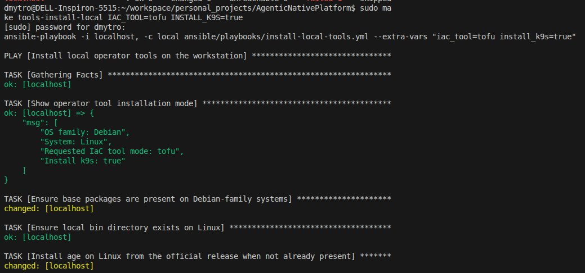
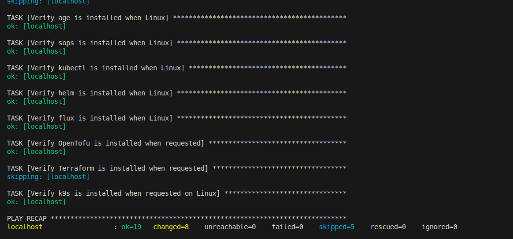
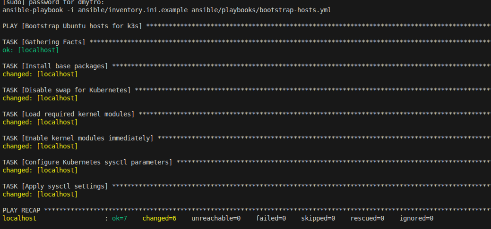
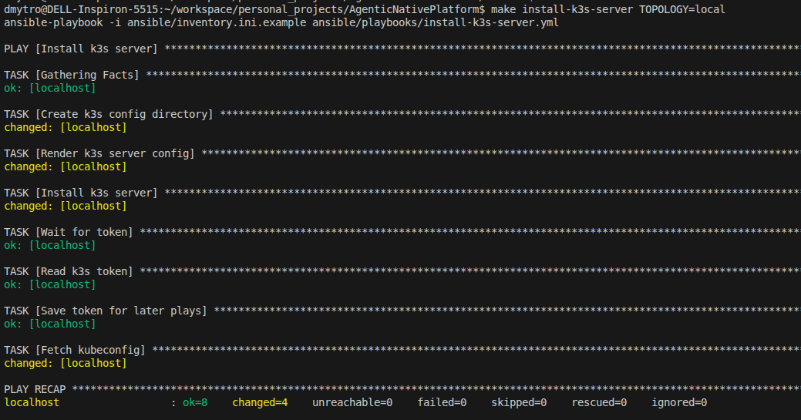
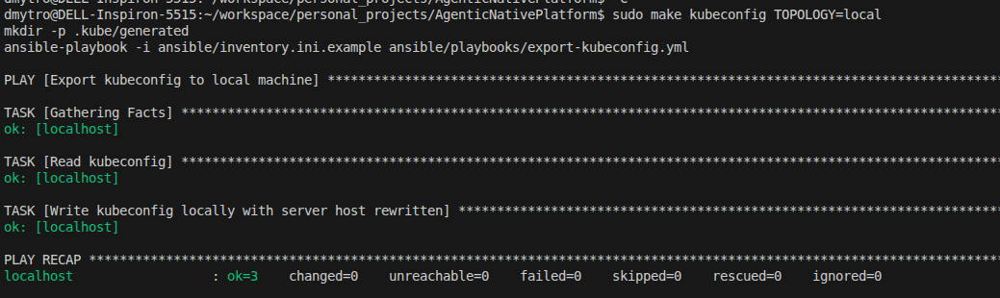

# Agentic Kubernetes Native Platform

GitOps-first Kubernetes platform for agentic AI workloads. The default path is a single-node local `k3s` cluster managed through Make targets, Flux, HelmReleases, and generated Flux inputs committed to this repository.

## What this repository manages

- `k3s` cluster bootstrap through Ansible
- Flux GitOps reconciliation from the remote Git branch
- `agentgateway`, `LiteLLM`, `kagent`, `KServe`
- optional local runtimes: `LM Studio`, `Ollama`, `vLLM`
- context services: `Qdrant`, `Redis`, `PostgreSQL`

The canonical request path is:

```text
kagent -> agentgateway -> LiteLLM -> provider or local runtime
```

## Supported topologies

- `local`
- `minipc`
- `hybrid`
- `hybrid-remote`

The default first-run mode is:

```env
TOPOLOGY=local
ENV=dev
RUNTIME=none
SECRETS_MODE=external
LMSTUDIO_ENABLED=false
IAC_TOOL=tofu
```

That keeps the first bootstrap simple: remote Gemini only, no in-cluster local runtime yet.

## Repository rules

Flux reads the remote Git repository, not your local working tree. Commit and push everything Flux needs before reconciling.

Commit:

- `charts/`
- `flux/components/`
- `flux/overlays/`
- `flux/generated/<topology>/`
- `flux/generated/clusters/<topology>-<env>-<runtime>-<secrets-mode>/`
- `flux/secrets/<env>/` only in `SECRETS_MODE=sops`
- `docs/`
- `scripts/`
- `mcp/`

Do not commit:

- `.env`
- `.kube/generated/`
- `.generated/`
- `ansible/generated/`
- local `terraform.auto.tfvars`
- local SOPS private keys

Generated local behavior:

- `make kubeconfig` writes `.kube/generated/current.yaml`
- the `Makefile` exports `KUBECONFIG` to that file automatically
- `flux/generated/<topology>/topology-values.yaml` is operator metadata only and must not be applied

## Install and bootstrap

### 1. Create `.env`

```bash
cp .env.example .env
```

Minimum example:

```env
TOPOLOGY=local
ENV=dev
RUNTIME=none
SECRETS_MODE=external
LMSTUDIO_ENABLED=false
IAC_TOOL=tofu

LOCAL_HOST_IP=192.168.1.108
LMSTUDIO_HOST_IP=192.168.1.108

GIT_REPO_URL=https://github.com/<your-user>/<your-repo>.git
GIT_BRANCH=dev

GOOGLE_API_KEY=your-real-key
GEMINI_MODEL=gemini-3.1-flash-lite-preview
LMSTUDIO_EMBEDDING_MODEL=text-embedding-qwen3-embedding-0.6b
EMBEDDING_MODEL=onnx-models/all-MiniLM-L6-v2-onnx
```

### 2. Install operator tools

```bash
make tools-install-local IAC_TOOL=tofu INSTALL_K9S=true
```

This installs `kubectl`, `helm`, `flux`, `age`, `sops`, and optional `k9s`.

### 3. Render and apply infrastructure inputs

```bash
make terraform-init TOPOLOGY=local TF_BIN=tofu
make terraform-apply TOPOLOGY=local TF_BIN=tofu
```

### 4. Bootstrap the host and install `k3s`

```bash
make bootstrap-hosts TOPOLOGY=local
make install-k3s-server TOPOLOGY=local
make kubeconfig TOPOLOGY=local
```

### 5. Install Flux controllers

For the local topology:

```bash
make install-flux-local
```

For a shared/non-local cluster:

```bash
make install-flux
# or
make install-flux KUBE_CONTEXT=dev-cluster
```

### 6. Create secrets for the first bootstrap

Use external secrets first:

```bash
make apply-plaintext-secrets ENV=dev
```

### 7. Render Flux inputs

```bash
make flux-values TOPOLOGY=local
make render-cluster-root TOPOLOGY=local ENV=dev RUNTIME=none SECRETS_MODE=external LMSTUDIO_ENABLED=false
```

Optional local validation:

```bash
kubectl kustomize flux/generated/local
kubectl kustomize flux/generated/clusters/local-dev-none-external
```

### 8. Commit and push generated Flux inputs

Flux cannot reconcile files that exist only locally.

```bash
git add charts flux docs scripts
git commit -m "Bootstrap platform manifests"
git push origin dev
```

### 9. Bootstrap Flux Git objects

```bash
make bootstrap-flux-git TOPOLOGY=local ENV=dev RUNTIME=none SECRETS_MODE=external LMSTUDIO_ENABLED=false
```

### 10. Reconcile and verify

```bash
make reconcile
make verify
```

The generated cluster root fans out into staged Flux Kustomizations:

- `platform-bootstrap`
- `platform-infrastructure`
- `platform-applications`

This ordering is intentional. CRD-providing charts reconcile before dependent custom resources.

## Change the platform safely

The intended lifecycle is:

1. edit manifests, values, or charts in Git
2. regenerate Flux inputs if topology/runtime inputs changed
3. commit
4. push
5. let Flux reconcile, or run `make reconcile`

Do not treat manual `helm install` or `helm upgrade` as the main operating model. Flux is the control plane here.

## Switch runtime modes

Remote-only:

```bash
make bootstrap-flux-git TOPOLOGY=local ENV=dev RUNTIME=none SECRETS_MODE=external LMSTUDIO_ENABLED=false
make reconcile
```

Remote Gemini + external LM Studio:

```bash
make bootstrap-flux-git TOPOLOGY=local ENV=dev RUNTIME=none SECRETS_MODE=external LMSTUDIO_ENABLED=true
make reconcile
```

Remote Gemini + Ollama:

```bash
make bootstrap-flux-git TOPOLOGY=local ENV=dev RUNTIME=ollama SECRETS_MODE=external LMSTUDIO_ENABLED=false
make reconcile
```

Remote Gemini + vLLM:

```bash
make bootstrap-flux-git TOPOLOGY=local ENV=dev RUNTIME=vllm SECRETS_MODE=external LMSTUDIO_ENABLED=false
make reconcile
```

## Optional echo MCP sample

`echo-mcp` is a sample MCP workload used by the `kmcp` / `RemoteMCPServer` examples. It is not required for the base platform bootstrap.
The image packaging under `mcp/echo-server/` now wraps the official reference package `@modelcontextprotocol/server-everything` from `modelcontextprotocol/servers` and exposes its real MCP streamable HTTP endpoint at `/mcp`. That reference server includes an `echo` tool.

Important:

- if `platform-applications` is failing, do not assume `echo-mcp` is the first cause
- fix Flux or CRD/schema reconciliation errors first
- only treat `echo-mcp` as a blocker after the application stage is applying successfully

The sample packaging lives in:

- `mcp/echo-server/`

To use it:

1. Decide whether you want a registry-backed image or a local-only image import.

Registry-backed flow:

```bash
docker build -t ghcr.io/<your-user>/echo-mcp:0.1.0 mcp/echo-server
docker push ghcr.io/<your-user>/echo-mcp:0.1.0
```

Local-only `k3s` flow without pushing:

```bash
make build-echo-mcp-image ECHO_MCP_IMAGE=ghcr.io/<your-user>/echo-mcp:0.1.0
make save-echo-mcp-image ECHO_MCP_IMAGE=ghcr.io/<your-user>/echo-mcp:0.1.0 ECHO_MCP_IMAGE_TARBALL=/tmp/echo-mcp-image.tar
make preimport-echo-mcp-image-tarball TOPOLOGY=local ECHO_MCP_IMAGE_TARBALL=/tmp/echo-mcp-image.tar
```

Or run the combined shortcut:

```bash
make prepare-echo-mcp-image-local TOPOLOGY=local ECHO_MCP_IMAGE=ghcr.io/<your-user>/echo-mcp:0.1.0 ECHO_MCP_IMAGE_TARBALL=/tmp/echo-mcp-image.tar
```

This works because `k3s` imports tarballs from `/var/lib/rancher/k3s/agent/images/` into containerd, and the sample Deployment now uses `imagePullPolicy: IfNotPresent`.
The image reference in the manifest must exactly match the imported tag.
The import target creates that directory automatically if your node does not have it yet.
Run the `make` target directly. On a local workstation, the ad-hoc Ansible command will use `sudo` and prompt if needed. Do not wrap it in `sudo make ...`.

2. Set `ECHO_MCP_IMAGE` in `.env` or pass it on the command line, then regenerate Flux inputs:

```bash
make flux-values TOPOLOGY=local ECHO_MCP_IMAGE=ghcr.io/<your-user>/echo-mcp:0.1.0
make render-cluster-root TOPOLOGY=local ENV=dev RUNTIME=none SECRETS_MODE=external LMSTUDIO_ENABLED=false
```

The source manifests no longer hard-code your concrete image tag. The real value is injected into the generated applications stage from `ECHO_MCP_IMAGE`.

3. Commit and push:

```bash
git add .env.example scripts/render-flux-values.sh scripts/render-cluster-kustomization.sh \
  flux/components/kmcp-resources/echo-mcpserver.yaml flux/components/kmcp/echo-mcpserver.yaml \
  flux/generated/local flux/generated/clusters/local-dev-none-external
git commit -m "Use real echo MCP sample image"
git push origin dev
```

4. Reconcile:

```bash
make reconcile
```

5. Verify:

```bash
kubectl -n kagent get deploy,svc,pods echo-mcp
kubectl -n kagent get remotemcpserver echo-mcp -o yaml
kubectl -n kagent logs deploy/echo-mcp
```

## Stop and restart the platform

Pause workloads without uninstalling the cluster:

```bash
make cluster-stop
```

Resume from Git desired state:

```bash
make cluster-start
```

`cluster-stop` now suspends the staged Flux Kustomizations and HelmReleases before scaling workloads down. `cluster-start` resumes them in order and reconciles the staged Kustomizations explicitly.
It also force-reconciles existing HelmReleases so workloads that were manually scaled to zero, such as `istiod`, are restored to their Helm-managed replica counts.
`metallb-system` is intentionally left running during `cluster-stop`; scaling the MetalLB controller to zero breaks its validating webhook and can block the next `platform-applications` reconcile on `IPAddressPool`.
For the default CPU TEI path, keep `EMBEDDING_MODEL` on an ONNX-backed model such as `onnx-models/all-MiniLM-L6-v2-onnx`; models without `model.onnx` artifacts can leave `tei-embeddings` stuck even when Flux itself is healthy.

## Move to SOPS later

Once the basic platform works, switch from `SECRETS_MODE=external` to `SECRETS_MODE=sops`.

```bash
make sops-age-key
make render-sops-secrets ENV=dev
make encrypt-secrets ENV=dev
make sops-bootstrap-cluster
```

Then switch `SECRETS_MODE=sops`, commit the encrypted manifests, push, and reconcile.

## Verify and test

```bash
make verify
make test-litellm
make port-forward-kagent
make test-a2a-agent
make port-forward-agentgateway
make test-agentgateway-openai
```

## Remove the environment

Remove `k3s` from the selected topology:

```bash
make uninstall-k3s TOPOLOGY=local
```

Destroy local Terraform/OpenTofu artifacts:

```bash
make terraform-destroy TOPOLOGY=local TF_BIN=tofu
```

## Troubleshooting

If a Flux command talks to `http://localhost:8080`, your shell is not using the repo kubeconfig. Use:

```bash
export KUBECONFIG="$PWD/.kube/generated/current.yaml"
```

If `make reconcile` or `make cluster-start` appears stuck, inspect the staged objects directly:

```bash
flux get kustomizations -A
flux get helmreleases -A
kubectl get pods -A
kubectl get events -A --sort-by=.lastTimestamp | tail -n 100
```

If `istio-cni` is not ready on `k3s`, verify the chart is using the K3s-specific paths:

- `cniConfDir=/var/lib/rancher/k3s/agent/etc/cni/net.d`
- `cniBinDir=/var/lib/rancher/k3s/data/cni`

## Additional docs

- [Operations](docs/OPERATIONS.md)
- [Commands](docs/commands.md)
- [Flux bootstrap notes](docs/flux-bootstrap.md)
- [Architecture](docs/architecture.md)
- [ADR index](docs/adr/README.md)


## Installation result example










