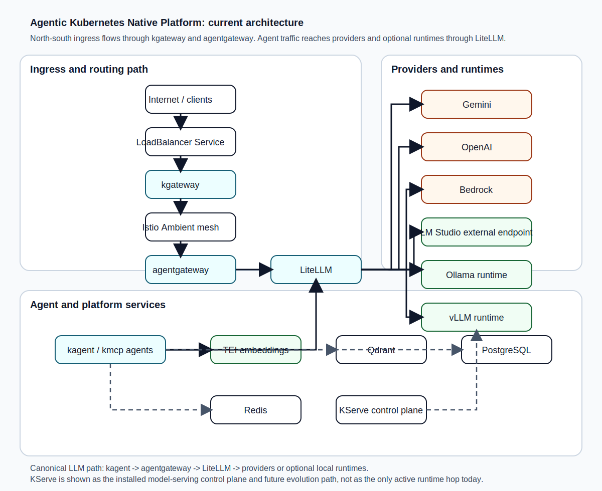
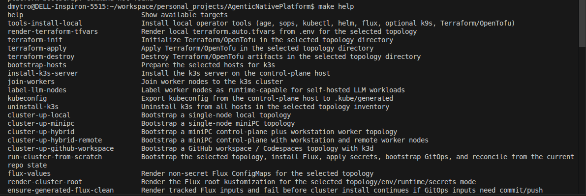
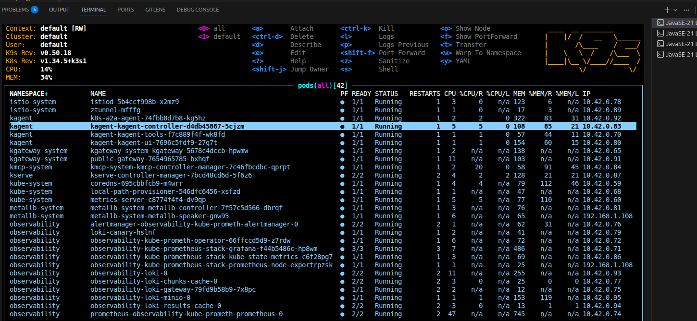
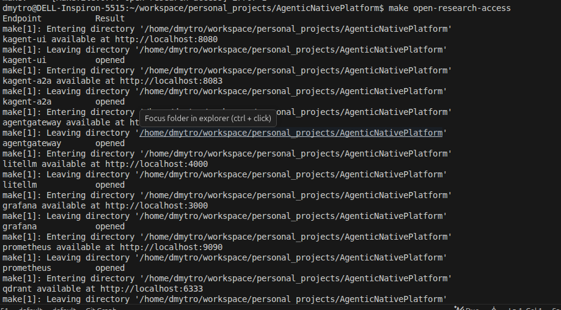
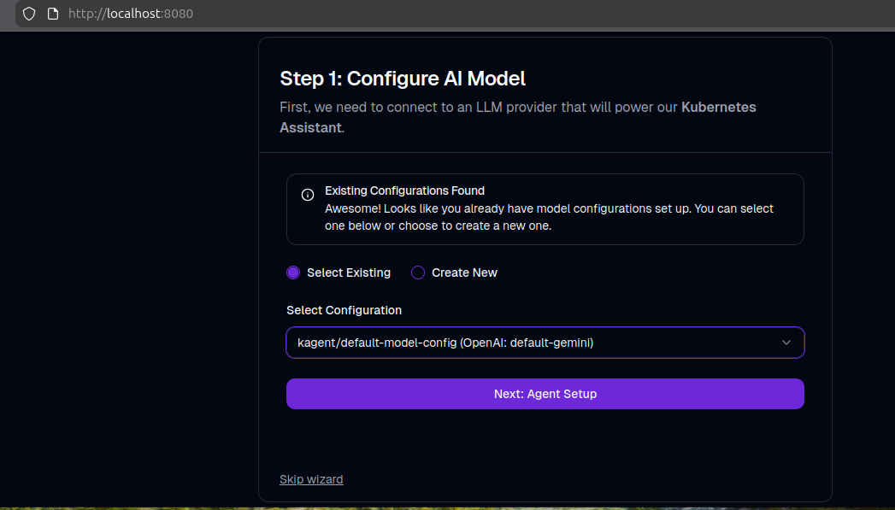
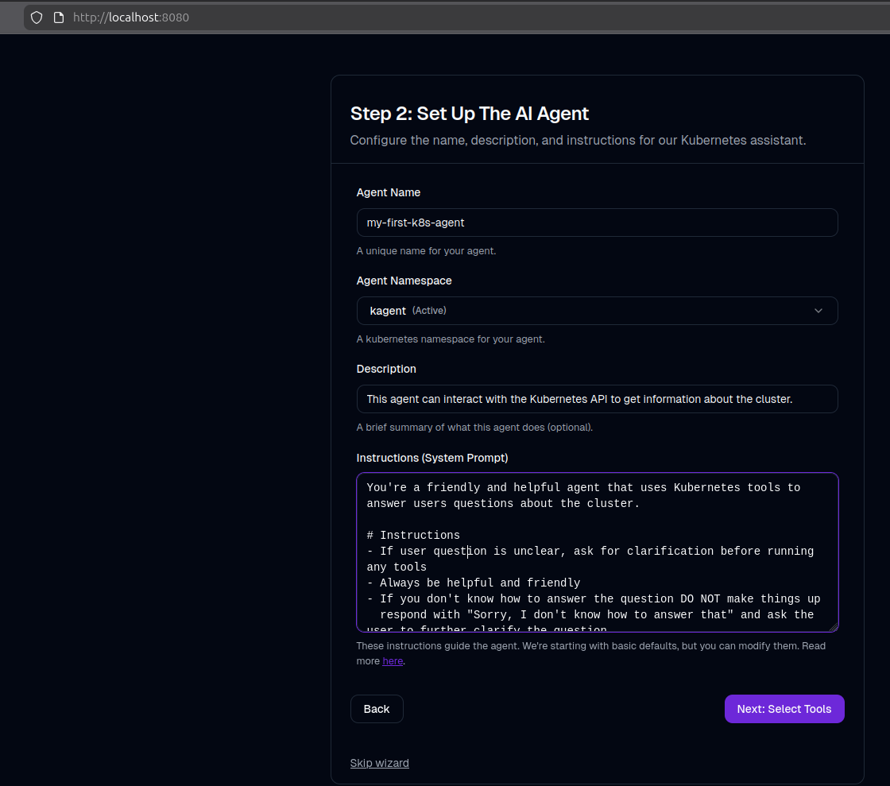
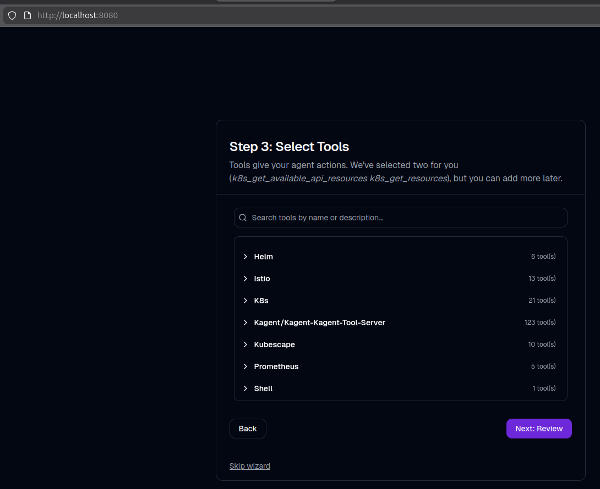

# AgenticNativePlatform

Cloud-native AI platform for Kubernetes-based agentic workloads.

The repository is GitOps-first. The active operating model is:

- generate topology-specific Flux inputs under `flux/generated/...`
- commit and push those generated manifests
- let Flux reconcile the staged platform roots from the remote Git branch

The canonical staged bootstrap path is:

- `platform-bootstrap`
- `platform-infrastructure`
- `platform-applications`

For deeper detail, see:

- [Architecture document](./docs/architecture.md)
- [Command reference](./docs/commands.md)
- [Operations guide](./docs/OPERATIONS.md)

## Architecture

Use the repository SVG as the primary architecture diagram:



Why this format:

- it renders reliably in GitHub and GitLab
- it opens directly in VS Code and IntelliJ IDEA
- it avoids Mermaid preview/plugin differences across IDEs

Architecture summary:

- `kgateway` is the north-south entry point.
- `agentgateway` is the protocol-aware AI gateway.
- `kagent` agents use:
  - `/v1` through `agentgateway -> LiteLLM -> provider or optional runtime`
  - `/mcp` through `agentgateway -> kmcp-managed MCP servers`
- `kmcp` manages `MCPServer` workloads and transport.
- `KServe` remains installed, but it is not forced into the default hot path yet.

Text fallback:

```text
External clients
  -> kgateway
  -> agentgateway

kagent agents
  -> agentgateway /v1/...  -> LiteLLM -> remote providers and optional local runtimes
  -> agentgateway /mcp/... -> kmcp-managed MCP servers

kmcp
  -> manages MCPServer workloads and transport

KServe
  -> remains installed for lightweight experiments and future self-hosted serving
```

MCP in this repository is intentionally gatewayed:

```text
kagent -> RemoteMCPServer -> agentgateway -> kmcp-managed MCP server
```

The optional `echo-mcp` sample follows that pattern. It is a real `MCPServer`, discovery is disabled intentionally, and the validation agent is `echo-validation-agent`.

## Assets

Useful repository assets:

- [Architecture SVG fallback](./.assets/architecture-current.svg)
- [make-help](.assets/make-help.png)
- [make-cluster-from-scratch](.assets/make-cluster-from-scratch.png)
- [make-cluster-from-scratch2](.assets/make-cluster-from-scratch2.png)
- [make-cluster-from-scratch3](.assets/make-cluster-from-scratch3.png)
- [make-k9s-local](.assets/make-k9s-local.png)
- [make-open-research-access](.assets/make-open-research-access.png)
- [make-open-kagent-ui](.assets/kagent-ui1.png)
- [make-open-kagent-ui2](.assets/kagent-ui2.png)
- [make-open-kagent-ui3](.assets/kagent-ui3.png)

## Supported topologies

| Topology | Cluster shape | Provisioning style | MetalLB | Typical use |
| --- | --- | --- | --- | --- |
| `local` | single-node local `k3s` | Terraform/OpenTofu + Ansible + host-level `k3s` | yes | default workstation path |
| `github-workspace` | single-node `k3d` | Docker + `k3d` | no | Codespaces / ephemeral workspaces |
| `minipc` | single-node remote `k3s` | Terraform/OpenTofu + Ansible | yes | dedicated home-lab node |
| `hybrid` | miniPC control plane + local worker | Terraform/OpenTofu + Ansible | yes | mixed home-lab / workstation |
| `hybrid-remote` | miniPC control plane + local and remote workers | Terraform/OpenTofu + Ansible | yes | larger mixed topology |

Topology notes:

- `local` is the default first-run path.
- `github-workspace` is the container-first developer topology.
- `github-workspace` uses `k3d`, skips MetalLB, and expects operator access through port-forwarding.
- `minipc`, `hybrid`, and `hybrid-remote` are intended for real multi-host environments.

Recommended first-run defaults:

```env
TOPOLOGY=local
ENV=dev
RUNTIME=none
SECRETS_MODE=external
LMSTUDIO_ENABLED=false
IAC_TOOL=tofu
```

That keeps the initial bootstrap simple:

- remote provider path enabled
- no local model runtime required
- plaintext bootstrap secrets instead of SOPS

## Quick start

### Fastest start

```bash
cp .env.example .env
# edit .env for your machine and credentials
make run-cluster-from-scratch
```

This is the preferred first-run command.

What it does:

1. installs local operator tools
2. provisions the selected topology
3. renders tracked Flux inputs
4. installs Flux
5. applies first-pass secrets
6. bootstraps the Flux Git objects
7. reconciles the staged platform roots
8. prints cluster status

Important:

- these steps are already part of `make run-cluster-from-scratch`
- you only need to run `make apply-plaintext-secrets`, `make bootstrap-flux-git`, and `make reconcile` manually if the one-command bootstrap stopped part-way through
- on a cold local cluster, the first reconciliation can take a long time because Helm is pulling large images and local-path is provisioning PVCs for the first time

If `run-cluster-from-scratch` stopped after Flux install but before Git bootstrap, resume with:

```bash
make apply-plaintext-secrets ENV=dev
make bootstrap-flux-git TOPOLOGY=$TOPOLOGY ENV=dev RUNTIME=none SECRETS_MODE=external LMSTUDIO_ENABLED=false
make reconcile
make cluster-status
```

### Fastest destroy

For Terraform/OpenTofu-based topologies:

```bash
make environment-destroy TOPOLOGY=local TF_BIN=tofu
```

For the workspace topology:

```bash
make environment-destroy TOPOLOGY=github-workspace TF_BIN=tofu
```

`github-workspace` uses the same target name, but the Makefile skips Terraform destroy for that topology and only removes the `k3d` cluster.

## `.env` file

Create your local copy:

```bash
cp .env.example .env
```

Do not commit `.env`.

### Minimum practical `.env` for a first bootstrap

```env
TOPOLOGY=local
ENV=dev
RUNTIME=none
SECRETS_MODE=external
LMSTUDIO_ENABLED=false
IAC_TOOL=tofu

LOCAL_HOST_IP=192.168.1.108
LMSTUDIO_HOST_IP=192.168.1.108

GIT_REPO_URL=https://github.com/<your-user>/<your-repo>.git
GIT_BRANCH=main

GOOGLE_API_KEY=your-real-key
GEMINI_MODEL=gemini-3.1-flash-lite-preview

EMBEDDING_MODEL=onnx-models/all-MiniLM-L6-v2-onnx
```

### Meaning of the main variables

Bootstrap and topology:

- `TOPOLOGY`: selects `local`, `github-workspace`, `minipc`, `hybrid`, or `hybrid-remote`
- `ENV`: selects the overlay and secrets environment, usually `dev`
- `RUNTIME`: selects the in-cluster chat runtime path
  - `none`: remote providers only
  - `ollama`: enable Ollama
  - `vllm`: enable vLLM
- `LMSTUDIO_ENABLED`: adds the external LM Studio integration path
- `SECRETS_MODE`: use `external` for the first bootstrap, `sops` after the platform is working
- `IAC_TOOL`: `tofu` or `terraform`

Host and network:

- `LOCAL_HOST_IP`: workstation IP used by the local topology
- `MINIPC_IP`, `REMOTE_WORKER_IP`: remote hosts for multi-host topologies
- `SSH_PRIVATE_KEY`: SSH key Ansible uses for remote nodes
- `K3S_VERSION`: k3s version for host-level clusters
- `CLUSTER_DOMAIN`: internal Kubernetes DNS suffix
- `METALLB_START`, `METALLB_END`: MetalLB address pool for non-workspace topologies
- `BASE_DOMAIN`: DNS suffix you want to use for LAN-facing URLs

GitOps:

- `GIT_REPO_URL`: remote repository that Flux reads from
- `GIT_BRANCH`: branch Flux should reconcile

Provider credentials:

- `GOOGLE_API_KEY`: default Gemini path used by LiteLLM
- `OPENAI_API_KEY`, `ANTHROPIC_API_KEY`, `AWS_*`, `VERTEX_*`: optional provider integrations

Runtime/model values:

- `LMSTUDIO_*`: external LM Studio endpoint and model names
- `EMBEDDING_MODEL`: TEI embedding model
- `OLLAMA_*`: Ollama version and default model
- `VLLM_*`: vLLM image and CPU tuning values
- `ECHO_MCP_IMAGE`: image tag for the optional sample MCP server

Secrets and SOPS:

- `SOPS_AGE_RECIPIENT`: optional age recipient for encrypted secrets

## Repository rules

Flux reads the remote Git repository, not your local working tree.
If rendered manifests change, commit and push them before expecting Flux to apply them.

Commit:

- `charts/`
- `flux/components/`
- `flux/overlays/`
- `flux/generated/<topology>/`
- `flux/generated/clusters/<topology>-<env>-<runtime>-<secrets-mode>/`
- `flux/secrets/<env>/` only when using `SECRETS_MODE=sops`
- `docs/`
- `scripts/`
- `mcp/`

Do not commit:

- `.env`
- `.kube/generated/`
- `.generated/`
- `ansible/generated/`
- local `terraform.auto.tfvars`
- local SOPS private keys

Generated behavior:

- `make kubeconfig` writes `.kube/generated/current.yaml`
- repo Make targets bind `kubectl` and `flux` to that kubeconfig
- `flux/generated/<topology>/topology-values.yaml` is operator metadata only and must not be applied to Kubernetes

## Step-by-step install and bootstrap

Use the one-command path first if you do not need to inspect each stage.
Use this manual path when you want to understand or troubleshoot each step.

### 1. Install operator tools

```bash
make tools-install-local IAC_TOOL=tofu INSTALL_K9S=true
```

This installs the repo operator toolchain such as `kubectl`, `helm`, `flux`, `age`, `sops`, and optional `k9s`.

### 2. Choose your topology

Default local workstation:

```bash
export TOPOLOGY=local
```

Codespaces / workspace:

```bash
export TOPOLOGY=github-workspace
```

### 3. Bootstrap the cluster

Single command:

```bash
make run-cluster-from-scratch TOPOLOGY=$TOPOLOGY ENV=dev RUNTIME=none SECRETS_MODE=external LMSTUDIO_ENABLED=false
```

Manual equivalent for `local`:

```bash
make terraform-init TOPOLOGY=local TF_BIN=tofu
make terraform-apply TOPOLOGY=local TF_BIN=tofu
make bootstrap-hosts TOPOLOGY=local
make install-k3s-server TOPOLOGY=local
make kubeconfig TOPOLOGY=local
make install-flux-local
make apply-plaintext-secrets ENV=dev
make bootstrap-flux-git TOPOLOGY=local ENV=dev RUNTIME=none SECRETS_MODE=external LMSTUDIO_ENABLED=false
make reconcile
make verify
```

Workspace equivalent:

```bash
make cluster-up-github-workspace ENV=dev RUNTIME=none SECRETS_MODE=external LMSTUDIO_ENABLED=false
make install-flux-local
make apply-plaintext-secrets ENV=dev
make bootstrap-flux-git TOPOLOGY=github-workspace ENV=dev RUNTIME=none SECRETS_MODE=external LMSTUDIO_ENABLED=false
make reconcile
make verify
```

### 4. Check the cluster

```bash
make cluster-status
make verify
make k9s-local
```

On the first local bootstrap, do not treat `Reconciliation in progress`, `ContainerCreating`, or `Pending` as an immediate failure.
The first install often needs extra time for:

- chart downloads
- image pulls
- PVC creation by `local-path`
- Helm retries after early dependency timeouts

### 5. Open the main local access paths

```bash
make open-research-access
```

Close them when finished:

```bash
make close-research-access
```

### 6. Quick end

Pause platform workloads without deleting the cluster:

```bash
make cluster-pause
```

Resume:

```bash
make cluster-resume
```

Remove only the cluster:

```bash
make cluster-remove TOPOLOGY=$TOPOLOGY
```

Remove the cluster and topology infrastructure:

```bash
make environment-destroy TOPOLOGY=$TOPOLOGY TF_BIN=tofu
```

## Secrets: start without SOPS, then move to SOPS

### First bootstrap: use plaintext external secrets

For the initial platform bring-up, keep:

```env
SECRETS_MODE=external
```

Then apply the generated plaintext secrets directly:

```bash
make apply-plaintext-secrets ENV=dev
```

Why start this way:

- fewer moving parts during the first bootstrap
- no decryption dependency inside Flux yet
- easier to debug provider keys and first reconciliation

### Later: switch to SOPS

After the basic platform is healthy, switch to encrypted secrets:

```bash
make sops-age-key
make render-sops-secrets ENV=dev
make encrypt-secrets ENV=dev
make sops-bootstrap-cluster
```

Then change:

```env
SECRETS_MODE=sops
```

And regenerate the cluster root:

```bash
make render-cluster-root TOPOLOGY=$TOPOLOGY ENV=dev RUNTIME=none SECRETS_MODE=sops LMSTUDIO_ENABLED=false
```

SOPS flow summary:

1. create a local age key
2. render plaintext secret inputs under `.generated/secrets/<env>/`
3. encrypt them into `flux/secrets/<env>/`
4. bootstrap the decryption secret into `flux-system`
5. switch the generated cluster root to `SECRETS_MODE=sops`

## Runtime modes

Remote provider only:

```bash
make bootstrap-flux-git TOPOLOGY=$TOPOLOGY ENV=dev RUNTIME=none SECRETS_MODE=external LMSTUDIO_ENABLED=false
make reconcile
```

Remote provider plus external LM Studio:

```bash
make bootstrap-flux-git TOPOLOGY=$TOPOLOGY ENV=dev RUNTIME=none SECRETS_MODE=external LMSTUDIO_ENABLED=true
make reconcile
```

Remote provider plus Ollama:

```bash
make bootstrap-flux-git TOPOLOGY=$TOPOLOGY ENV=dev RUNTIME=ollama SECRETS_MODE=external LMSTUDIO_ENABLED=false
make reconcile
```

Remote provider plus vLLM:

```bash
make bootstrap-flux-git TOPOLOGY=$TOPOLOGY ENV=dev RUNTIME=vllm SECRETS_MODE=external LMSTUDIO_ENABLED=false
make reconcile
```

KServe remains installed across these modes.
For lightweight KServe validation, apply the sample under `flux/components/kserve/samples/hf-tiny-inferenceservice.yaml`.

## Access and endpoints

### Local operator access

Open the common local access paths:

```bash
make open-research-access
```

This exposes:

- `http://localhost:8080` for the `kagent` UI
- `http://localhost:8083/api/a2a/kagent/k8s-a2a-agent/.well-known/agent.json` for the sample A2A card
- `http://localhost:15000/v1/models` for `agentgateway`
- `http://localhost:4000/v1/models` for `LiteLLM`
- `http://localhost:3000` for Grafana
- `http://localhost:9090` for Prometheus
- `http://localhost:6333/dashboard` for Qdrant

Open a single endpoint when needed:

```bash
make open-kagent-ui
make open-kagent-a2a
make open-agentgateway
make open-litellm
make open-grafana
make open-prometheus
make open-qdrant
```

Foreground port-forward variants:

```bash
make port-forward-kagent-ui
make port-forward-kagent
make port-forward-agentgateway
make port-forward-litellm
```

### What about `kmcp` and `kgateway` UIs?

- `kmcp` does not provide a separate browser UI in this repository.
- `kgateway` is part of the ingress path, not a user-facing UI service.
- Use `kubectl`, Flux status, and the routed endpoints for those components.

### Localhost testing

Test LiteLLM:

```bash
make test-litellm
```

Test AgentGateway:

```bash
make test-agentgateway-openai
```

Manual curls:

```bash
curl -H "Authorization: Bearer ${LITELLM_MASTER_KEY:-change-me}" http://localhost:4000/v1/models
curl -H "Authorization: Bearer ${LITELLM_MASTER_KEY:-change-me}" http://localhost:15000/v1/models
```

### Local network access

On topologies with MetalLB, the canonical external service is `agentgateway-proxy`.
When MetalLB assigns an IP, the external AgentGateway endpoint is:

```text
http://<metallb-ip>:8080/v1/models
```

For friendly names on your LAN:

1. choose `BASE_DOMAIN`
2. point local DNS or `/etc/hosts` entries at the MetalLB IP
3. use `kgateway` / `agentgateway` through those addresses

### Internet access

This repository gives you the in-cluster ingress building blocks:

- `kgateway`
- `agentgateway`
- Gateway API resources

To expose them to the internet you still need:

- public routing or port-forward from your environment
- DNS that resolves to the reachable IP
- firewall / router rules outside this repository

The repo automates the cluster and GitOps side, not your public edge networking.

## Working with the optional echo MCP sample

The `echo-mcp` sample exists to validate the MCP path through:

```text
kagent -> RemoteMCPServer -> agentgateway -> kmcp-managed MCP server
```

Build and import a local image without pushing:

```bash
make build-echo-mcp-image ECHO_MCP_IMAGE=ghcr.io/<your-user>/echo-mcp:0.1.0
make save-echo-mcp-image ECHO_MCP_IMAGE=ghcr.io/<your-user>/echo-mcp:0.1.0 ECHO_MCP_IMAGE_TARBALL=/tmp/echo-mcp-image.tar
make prepare-echo-mcp-image-local TOPOLOGY=$TOPOLOGY ECHO_MCP_IMAGE=ghcr.io/<your-user>/echo-mcp:0.1.0 ECHO_MCP_IMAGE_TARBALL=/tmp/echo-mcp-image.tar
```

Then regenerate the Flux inputs with the same image tag:

```bash
make flux-values TOPOLOGY=$TOPOLOGY ECHO_MCP_IMAGE=ghcr.io/<your-user>/echo-mcp:0.1.0
make render-cluster-root TOPOLOGY=$TOPOLOGY ENV=dev RUNTIME=none SECRETS_MODE=external LMSTUDIO_ENABLED=false
```

Workspace note:

- on `TOPOLOGY=github-workspace`, the image is imported into `k3d`
- on host-level `k3s` topologies, the image is imported into `k3s` containerd

## Pause, resume, and safe restart behavior

Pause platform workloads without removing the cluster:

```bash
make cluster-pause
```

Resume from Git desired state:

```bash
make cluster-resume
make cluster-status
```

Important behavior:

- `cluster-pause` suspends the staged Flux roots and HelmReleases
- `cluster-pause` snapshots Deployment and StatefulSet replica targets in `ConfigMap/flux-system/cluster-pause-state` before scaling platform namespaces to zero
- `cluster-resume` reconciles `platform-bootstrap`, restores the saved replica targets, fans out HelmRelease reconcile annotations, then waits on higher stages
- `cluster-stop` and `cluster-start` remain compatibility aliases

Design detail:

- `metallb-system` is intentionally not scaled to zero because its validating webhook is needed on the next reconcile
- the staged Flux health budgets are longer than the per-stage defaults because some HelmReleases in this repo have 15-30 minute cold-start timeouts

## Validate and troubleshoot

Basic checks:

```bash
make verify
make cluster-status
```

Inspect the cluster:

```bash
make k9s-local
kubectl --kubeconfig .kube/generated/current.yaml get pods -A
flux --kubeconfig .kube/generated/current.yaml get kustomizations -A
flux --kubeconfig .kube/generated/current.yaml get helmreleases -A
```

Validate the lightweight KServe sample:

```bash
kubectl --kubeconfig .kube/generated/current.yaml apply -f flux/components/kserve/samples/hf-tiny-inferenceservice.yaml
kubectl --kubeconfig .kube/generated/current.yaml -n ai-models get inferenceservice flan-t5-small -w
```

Recommended validation order:

1. bootstrap the remote-provider path first
2. validate MCP through `echo-validation-agent`
3. validate KServe through `hf-tiny-inferenceservice.yaml`
4. only then move to larger self-hosted runtime experiments

## Switching topologies

Each topology uses the same main bootstrap target with different parameters:

Local workstation:

```bash
make run-cluster-from-scratch TOPOLOGY=local ENV=dev RUNTIME=none SECRETS_MODE=external LMSTUDIO_ENABLED=false
```

GitHub workspace / Codespaces:

```bash
make run-cluster-from-scratch TOPOLOGY=github-workspace ENV=dev RUNTIME=none SECRETS_MODE=external LMSTUDIO_ENABLED=false
```

miniPC:

```bash
make run-cluster-from-scratch TOPOLOGY=minipc ENV=dev RUNTIME=none SECRETS_MODE=external LMSTUDIO_ENABLED=false
```

Hybrid:

```bash
make run-cluster-from-scratch TOPOLOGY=hybrid ENV=dev RUNTIME=none SECRETS_MODE=external LMSTUDIO_ENABLED=false
```

Hybrid remote:

```bash
make run-cluster-from-scratch TOPOLOGY=hybrid-remote ENV=dev RUNTIME=none SECRETS_MODE=external LMSTUDIO_ENABLED=false
```

## Safe change workflow

When you change manifests, charts, or generated inputs:

1. edit the repo files
2. regenerate Flux inputs if topology/runtime inputs changed
3. validate with `kubectl kustomize`
4. commit and push
5. run `make reconcile`

Do not treat manual `helm install` or `helm upgrade` as the primary operating model.
Flux is the control plane for this repository.


## Visual Examples of work:

call help documentation:



qick start of the cluster:


k9s monitoring (make k9s-local):



make open-research-access:



kagent UI (previously run make open-kagent-ui or make open-research-access -- see above):





And other steps:
- [make-open-kagent-ui4](.assets/kagent-ui4.png)
- [make-open-kagent-ui5](.assets/kagent-ui5.png)
- [make-open-kagent-ui6](.assets/kagent-ui6.png)